Attention is an influential mechanism in deep learning that has achieved state-of-the-art results in many domains such as natural language processing, visual understanding, speech recognition, multi-modal learning, and more. In this article, popular attention layers in computer vision specifically will be studied and implemented in PyTorch. 
Each module is accompanied by detailed descriptions, visualizations, and code, plus optional mathematical formulations for those preferring more formal expositions.
<!--more-->The GitHub repository for this article can be found [here](https://github.com/bobmcdear/attention-in-vision).

---

# Table of Contents

1. **[Introduction](#introduction)** 
2. **[Sqeueeze-and-Excitaiton](#squeeze-and-excitation)** 
3. **[Efficient Channel Attention](#efficient-channel-attention)** 
4. **[Convolutional Block Attention Module](#convolutional-block-attention-module)**
5. **[Bottleneck Attention Module](#bottleneck-attention-module)**
6. **[Gather-Excite](#gather-excite)**
7. **[Selective Kernel](#selective-kernel)**
8. **[Split Attention](#split-attention)**
9. **[Conditionally Parameterized Convolution](#cond-conv)**
10. **[Dynamic Convolution](#dy-conv)**
11. **[Multi-Headed Self-Attention](#mhsa)**
12. **[Conclusion](#conclusion)**

---

# 1. Introduction
As the name suggests, attention enables deep learning models to pay attention to certain parts of the data[[3]](#[3]), similar to how attention in humans works[[15]](#[15]). For instance, in natural language processing (NLP), attention-based models can attend
to words that convey more information and ignore ones that are somewhat akin to noise and do not contribute
much to the meaning of the text[[21]](#[21]) ([figure 1.1](#figure_1.1)).  

Figure 1.1. The words crucial to understanding this sentence are highlighted in red. Image by the author.

 
In computer vision, a similar idea would be for a neural network to focus on a particular part of an image. <a href="#figure_1.2">Figure 1.2</a>
exhibits this concept; a model would greatly benefit from an attention mechanism that could 
focus on the lionesses.  

Figure 1.2. By attending to the lionesses,
a model can perform more accurate object recognition. Original image from ImageNet.

 

[Equation 1.1](#equation_1.1), proposed in [[9]](#[9]), is a general formulation of attention
for input \\(X\\) that is helpful for gaining a high-level, intuitive understanding of this powerful mechanism. \\(g\\) is a function that
generates a set of attention values for every part of the input (i.e., how much to attend to, or the importance of, each item in \\(X\\), be it a word, pixel, etc.), 
and \\(f\\) processes \\(X\\) using the output of \\(g\\), e.g., multiply every element by its attention value so the more important bits of \\(X\\) would be more salient and have larger magnitudes.

$$
\textrm {Attention}(X) = f(g(X), X)
$$

Equation 1.1.

 
Finally, <a href="#table_1.1">table 1.1</a> summarizes recurring mathematical notations that will be referred to in this article.  

| **Notation**                      | **Definition**                  |
|-----------------------------------|---------------------------------|
| \\(s\\) (lowercase italicized letter)              | Scalar                          |
| \\(\bold v\\) (lowercase bold letter)     | Vector                          |
| \\(\bold M\\) (uppercase bold letter)     | Matrix                          |
| \\(T\\) (uppercase italicized letter) | Tensor with a minimum rank of 3 |
| \\(\bold v_i\\) | \\(i^{\textrm{th}}\\) element of \\(\bold v\\); one-based indexing|
| \\(\bold M_{i,j}\\) | Entry of \\(\bold M\\) at row \\(i\\) and column \\(j\\); one-based indexing|
| \\(T_{i,j,k}\\) | Entry of \\(T\\) with index \\(i\\) for the first axis, \\(j\\) for the second one, \\(k\\) for the third, and so forth; one-based indexing|
| \\(:\\)                              | Used to denote entire axis when indexing matrices or tensors, e.g., \\(\bold M_{i,:}\\) accesses row \\(i\\)                          |
| \\(\delta\\)                              | ReLU                            |
| \\(\sigma\\)                           | Sigmoid                         |
| \\(\odot\\)                               | Hadamard product            |
| \\(*\\)                                 | Convolution operation           |
| \\(\textrm{BN}\\)                                 | Batch normalization; parameters not shown           |

Table 1.1. Mathematical notations prevalent in this article. Common ones, such as \(\sum\) (summation), are not included.
 

> The mathematical formulations in this article are generally faithful to their associated implementations, but not always; for the sake of simplicity, some equations are not utterly precise and might not correspond exactly to the code, e.g., bias terms of linear layers are not included in the equations.

---

# 2. Squeeze-and-Excitation
One of the earliest and most impactful attention mechanisms in computer vision is squeeze-and-excitation (SE)[[14]](#[14]), an algorithm ubiquitous in numerous state-of-the-art (SOTA) networks such as EfficientNet[[33]](#[33])[[34]](#[34]), Normalizer-Free Networks (NFNet)[[4]](#[4])[[5]](#[5]), and RegNet[[25]](#[25]). Research evinces various channels in a feature map represent different objects[[9]](#[9]), and channel attention enables the network to dynamically focus on important channels, i.e., objects.  Unsurprisingly, SE is constituted of two ingredients; a squeeze module, where the activations of each channel are aggregated through global average pooling, and an excitation module, whose job is to capture channel interactions by passing the output of the squeeze module to a bottlenecked multilayer perceptron (MLP). Formally,
let   \\(X \isin \reals^{c \times h \times w} \\), \\(F_{sq}\\), and \\(F_{ex}\\) be the input, squeeze module, and excitation
module respectively. \\(F_{sq}\\) is applied over \\(X\\) to obtain vector \\(\bold z \isin \reals^{c}\\) ([equation 2.1](#equation_2.1)). Without global pooling, the excitation module would be confined to a small receptive field, resulting in subpar performance.

$$
\bold z_{i} = \frac {1} {hw} \sum_{j = 1} ^{h} \sum_{k = 1} ^{w} X_{i,j,k}
$$

Equation 2.1. \(\forall i \isin {\{1, 2, ..., c\}}\).

 
\(\bold z\) is transformed with \(F_{ex}\) to acquire an attention vector \(\bold a \isin \reals^{c}\), where
\(\bold a_{i}\) may be viewed as the importance of the \(i^{\textrm{th}}\) channel for this particular input.
\(F_{ex}\) is an MLP containing two linear layers with weight matrices \(\bold W_{1} \isin \reals^{\frac {c} {r} \times c}\) and \(\bold W_{2} \isin \reals^{c \times \frac {c} {r}}\), plus ReLU between them and the sigmoid function at the end (<a href="#equation_2.2">equation 2.2</a>). \(r\) is a hyperparameter that controls the size of the bottleneck, which lessens the computational complexity and helps generalization.

$$
\bold a = F_{ex}(\bold z; \bold W_1, \bold W_2) =  \sigma (\bold W_{2} \delta (\bold W_{1}\bold z))
$$

Equation 2.2.

 

\\(\tilde {X} \isin \reals^{c \times h \times w}\\), the final output, is computed by multiplying every channel by its associated attention value from \\(\bold a \\) (<a href="#equation_2.3">equation 2.3</a>). 

$$
\tilde{X}_{i, :, :} = \bold a_{i}X_{i, :, :}
$$

Equation 2.3. \(\forall i \isin {\{1, 2, ..., c\}}\).

 

A graphical illustration can be found in [figure 2.1](#figure_2.1), and SE is implemented in [snippet 2.1](#snippet_2.1).  

Figure 2.1. Overview of squeeze-and-excitation. Image from figure 1 of 
<a href="#[14]">[14]</a>.

 


import torch									
from torch import nn
from torch.nn import functional as F

class SE(nn.Module):
	"""
	Squeeze-and-excitation.

	Args:
		in_dim (int): Number of input channels.
		reduction_factor (int): Reduction factor for the 
		bottleneck layer.
		Default is 16.
	"""
	def __init__(
		self, 
		in_dim: int,
		reduction_factor: int = 16,
		) -> None:
		super().__init__()

		bottleneck_dim = in_dim//reduction_factor
		self.excitation = nn.Sequential(
			nn.Conv2d(
				in_channels=in_dim,
				out_channels=bottleneck_dim,
				kernel_size=1,
				),
			nn.ReLU(),
			nn.Conv2d(
				in_channels=bottleneck_dim,
				out_channels=in_dim,
				kernel_size=1,
				),
			nn.Sigmoid(),
			) 
	
	def forward(self, input: torch.Tensor) -> torch.Tensor:
		squeezed = F.adaptive_avg_pool2d(input, 1)
		attention = self.excitation(squeezed)
		output = attention*input
		return output


Snippet 2.1. Since the spatial size of the average-pooled data is \(1\) x \(1\), a convolution of kernel size \(1\) x \(1\) and a fully-connected linear layer would be equivalent.

 

Empirically, squeeze-and-excitation performs very well. By appending SE to each network block in popular convolutional neural networks (CNN), top-1 accuracy is boosted
on ImageNet ([table 2.1](#table_2.1)).  

| **Architecture** | **Plain** | **With SE** |
|------------------|-----------|-------------|
| ResNet-50        | 75.20%    | 76.71%      |
| ResNet-101       | 76.83%    | 77.62%      |
| ResNet-152       | 77.58%    | 78.43%      |
| ResNeXt-50       | 77.89%    | 78.90%      |
| ResNeXt-101      | 78.82%    | 79.30%      |
| MobileNet        | 71.60%    | 74.70%      |

Table 2.1. Top-1 accuracies of various CNNs, with or without SE, on ImageNet.

---

# 3. Efficient Channel Attention

An important aspect of squeeze-and-excitation is the bottleneck in its excitation module, where dimensionality reduction (DR) is performed to parsimoniously compute channel interactions. Due to DR, the attention values and their associated channels have only indirect correspondence, and there is no direct mapping between the channels and their attention values ([figure 3.1](#figure_3.1)).  

Figure 3.1.
Dimensionality reduction in the excitation module of SE.
Image by the author.

 

To gauge the ramifications of dimensionality reduction in SE, [[37]](#[37]) developed three derivatives of squeeze-and-excitation, differing in terms of their
excitation modules: SE-Var-1, where the excitation module is merely
the sigmoid function (<a href="#figure_3.2">figure 3.2</a>), SE-Var-2, where the excitation module element-wise multiplies the pooled channels by learnable weights, followed, as usual, by sigmoid (<a href="#figure_3.3">figure 3.3</a>), and SE-Var-3, where the excitation module is a fully-connected layer, again
succeeded by sigmoid (<a href="#figure_3.4">figure 3.4</a>). SE-Var-3 is the same as effective
squeeze-and-excitation (eSE)<a href="#[17]">[17]</a>, a variant of SE for instance segmentation discussed in a separate, unrelated paper.  

Figure 3.2. The excitation module of SE-Var-1. Ibid.

 

Figure 3.3. The excitation module of SE-Var-2. Sigmoid is not shown. Ibid.
 

Figure 3.4. The excitation module of SE-Var-3. Sigmoid is not shown. Ibid.
 

The mathematical formulations for SE-Var-1, SE-Var-2, and SE-Var-3 are identical to squeeze-and-excitation, except for their excitation modules. [Equations 3.1](#equation_3.1),
[3.2](#equation_3.2), and <a href="#equation_3.3">3.3</a> define \\(F_{ex}\\) for these variants, where \\(\bold z \isin \reals^{c}\\) is the output of the squeeze module. [Snippet 3.1](#snippet_3.1) implements them.

$$
F_{ex}(\bold z) = \sigma (\bold z) 
$$

Equation 3.1. The excitation module for SE-Var-1.
 

$$
F_{ex}(\bold z; \bold w) = \sigma (\bold w \odot \bold z) 
$$

Equation 3.2. The excitation module for SE-Var-2. \(\bold w \isin \reals^{c} \).
 

$$
F_{ex}(\bold z; \bold W) = \sigma (\bold W \bold z) 
$$

Equation 3.3. The excitation module for SE-Var-3. \(\bold W \isin \reals^{c \times c} \).
 


import torch									
from torch import nn
from torch.nn import functional as F

class SEVar1(nn.Module):
	"""
	Squeeze-and-excitation, variant 1.
	"""
	def __init__(self) -> None:
		super().__init__()

		self.excitation = nn.Sigmoid()
	
	def forward(self, input: torch.Tensor) -> torch.Tensor:
		squeezed = F.adaptive_avg_pool2d(input, 1)
		attention = self.excitation(squeezed)
		output = attention*input
		return output

class SEVar2(nn.Module):
	"""
	Squeeze-and-excitation, variant 2.

	Args:
		in_dim (int): Number of input channels.
	"""
	def __init__(
		self, 
		in_dim: int,
		) -> None:
		super().__init__()

		self.excitation = nn.Sequential(
			nn.Conv2d(
				in_channels=in_dim,
				out_channels=in_dim,
				kernel_size=1,
				groups=in_dim,
				),
			nn.Sigmoid(),
			) 
	
	def forward(self, input: torch.Tensor) -> torch.Tensor:
		squeezed = F.adaptive_avg_pool2d(input, 1)
		attention = self.excitation(squeezed)
		output = attention*input
		return output

class SEVar3(nn.Module):
	"""
	Squeeze-and-excitation, variant 3.

	Args:
		in_dim (int): Number of input channels.
	"""
	def __init__(
		self, 
		in_dim: int,
		) -> None:
		super().__init__()

		self.excitation = nn.Sequential(
			nn.Conv2d(
				in_channels=in_dim,
				out_channels=in_dim,
				kernel_size=1,
				),
			nn.Sigmoid(),
			) 
	
	def forward(self, input: torch.Tensor) -> torch.Tensor:
		squeezed = F.adaptive_avg_pool2d(input, 1)
		attention = self.excitation(squeezed)
		output = attention*input
		return output


Snippet 3.1. For SE-Var-2, a convolution with \(c\) groups element-wise multiplies the input by a set of weights.

 
Since neither of these variants employs dimensionality reduction, pitting them against SE offers an idea of the 
consequences of DR (<a href="#table_3.1">table 3.1</a>). Nonetheless, this is not an apples-to-apples comparison because SE-Var-1 and SE-Var-2
do not model channel interactions and are not technically attention modules.  

| **Variant** | **Top-1 accuracy** |
|------------------|--------------------|
| Original SE        | 76.71%             |
| SE-Var-1            | 76.00%             |
| SE-Var-2            | 77.07%             |
| SE-Var-3            | 77.42%             |

Table 3.1. Accuracies of SE, SE-Var-1, SE-Var-2, and SE-Var-3 on ImageNet, with ResNet-50 as the backbone.

 
SE-Var-2 attests to the merit of direct channel-to-attention communication, for it is far lighter than SE but exceeds its score. 
Its principal drawback is that there are no inter-channel interactions, 
an issue that is solved by the more accurate SE-Var-3 using a linear layer that 
connects every channel to every attention value. Unfortunately, SE-Var-3’s cost is quadratic,
and there being no bottleneck, the computational complexity is markedly increased.  
A compromise between SE-Var-2 and SE-Var-3 is made; in lieu of SE-Var-3's <i>global</i> cross-channel attention, where every two channels
interact with one another, <i>local</i> cross-channel relationships are utilized. Concretely, each channel interacts only with its \(k\) neighbours
through linear layers that operate on \(k\) channels at a time.
To further reduce the parameter count, the linear layers can share parameters, thereby being equivalent to a one-dimensional
convolution sliding over the pooled channels. This final version, illustrated in <a href="#figure_3.5">figure 3.5</a> and formulated
mathematically in <a href="#equation_3.4">equation 3.4</a>, is dubbed efficient channel attention (ECA) and has the advantages of both inter-channel interactions and direct channel-to-attention communication whilst maintaining the efficiency of SE-Var-2.  

Figure 3.5. 
In this example, \(k = 3\). The grey nodes represent padding for maintaining the number of 
features. Though not specified in this figure, 
the parameters of these connections are shared. Ibid.

$$
F_{ex}(\bold z; \bold w) = \sigma (\bold w * \bold z) 
$$

Equation 3.4. The excitation module for ECA. \(\bold w \isin \reals^{k} \). \(\bold z\) is padded beforehand.

 
The computational complexity of SE-Var-2, SE-Var-3, and ECA are outlined in <a href="#table_3.2">table 3.2</a>. Assuming \(k \ll c \), which virtually always holds, ECA is drastically more efficient than SE-Var-3 and almost on par with
SE-Var-2 in terms of complexity. It is also more efficient than the original SE.  

| **Variant** | **Complexity** |
|------------------|--------------------|
| SE-Var-2         | \\(\mathcal{O}(c)\\)|
| SE-Var-3         | \\(\mathcal{O}(c^2)\\)            |
| ECA            | \\(\mathcal{O}(kc)\\)            |

Table 3.2. Computational complexity of SE-Var-2, SE-Var-3, and ECA.

 
The kernel size of ECA's convolution is a hyperparameter to be tuned, and the authors set forth a heuristic, described in <a href="#equation_3.5">equation 3.5</a>, for calculating it given the number of input channels. Intuitively, more channels require larger kernel sizes, as reflected by this equation.

$$
k =  \bigg | \frac{\log_2(c)}{\gamma} + \frac{\beta}{\gamma} \bigg |_{odd}
$$

Equation 3.5. \(\gamma\) and \(\beta\) are tunable arguments that are by default set to \(2\) and \(1\) respectively.
\(| a |_{odd}\) denotes the odd integer nearest to \(a\).

 

The PyTorch implementation of ECA is in <a href="#snippet_3.2">snippet 3.2</a>, and its
chief difference from the other variants of SE is that the output of the average pooling layer
must be in a channels-last format to be able to be
passed to the convolution, but the data must be reverted to channels first before being returned.  


from math import log
from typing import Optional

import torch
from torch import nn
from torch.nn import functional as F

def get_kernel_size(
	in_dim: int,
	beta: int = 1,
	gamma: int = 2,
	) -> int:
	"""
	Calculates the optimal kernel size for ECA.

	Args:
		in_dim (int): Number of input channels.
		beta (int): Beta parameter.
		Default is 1.
		gamma (int): Gamma parameter.
		Default is 2.
	
	Returns (int): Optimal kernel size for ECA given in_dim.
	"""
	t = int((log(in_dim, 2) + beta) / gamma)
	kernel_size = t if t%2 == 1 else t+1
	return kernel_size

class ECA(nn.Module):
	"""
	Efficient channel attention.

	Args:
		beta (int): Beta parameter for calculating the kernel size.
		Default is 1.
		gamma (int): Gamma parameter for calculating the kernel size.
		Default is 2.
		in_dim (Optional[int]): Number of input channels. This value cannot 
		be None if kernel_size is None.
		Default is None.
		kernel_size (Optional[int]): Kernel size. If None, beta and gamma
		are used to calculate the kernel size. Otherwise, beta and gamma
		are ignored, and this value is used as the kernel size instead.
		Default is None.
	"""
	def __init__(
		self, 
		beta: int = 1,
		gamma: int = 2,
		in_dim: Optional[int] = None,
		kernel_size: Optional[int] = None,
		) -> None:
		super().__init__()

		if kernel_size is None:
			kernel_size = get_kernel_size(in_dim,beta, gamma)
		
		self.conv = nn.Conv1d(
			in_channels=1,
			out_channels=1,
			kernel_size=kernel_size,
			padding=kernel_size//2,
			bias=False,
			)
	
	def forward(self, input: torch.Tensor) -> torch.Tensor:
		avg_pooled = F.adaptive_avg_pool2d(input, 1)
		avg_pooled = avg_pooled.squeeze(2)
		avg_pooled = avg_pooled.transpose(1, 2)

		attention = self.conv(avg_pooled)
		attention = F.sigmoid(attention)
		attention = attention.transpose(1, 2)
		attention = attention.unsqueeze(2)
		
		output = attention*input
		return output


Snippet 3.2.

 
ECA outperforms SE with ResNets of different depths and MobileNetV2 at a lower computational cost and parameter count, as shown in <a href="#table_3.3">table 3.3</a>.  

| **Architecture** | **Plain** | **With SE** | **With ECA** |
|------------------|-----------|-------------|--------------|
| ResNet-50        | 75.20%    | 76.71%      | 77.48%       |
| ResNet-101       | 76.83%    | 77.62%      | 78.65%       |
| ResNet-152       | 77.58%    | 78.43%      | 78.92%       |
| MobileNetV2       | 71.64%    | 72.42%      | 72.56%       |

Table 3.3. Top-1 accuracies of ResNets and MobileNetV2, with SE, ECA, or neither, on ImageNet.

 

---

# 4. Convolutional Block Attention Module

Following the efficacy of attention-based networks and SE in particular, <a href="#[39]">[39]</a> introduced convolutional block attention module (CBAM), a hybrid attention module that mixes channel attention with spatial attention, for further performance boosts. Whereas channel attention is a dynamic module for determining which channels to focus on, spatial attention dynamically decides _where_ to focus on, that is, which pixels are more relevant.

The channel attention module of CBAM is similar to SE, but the two diverge in one aspect, viz., CBAM also utilizes max pooling in addition to average pooling. Specifically, there are two squeeze modules, \\(F_{sq}^1\\) and \\(F_{sq}^2\\), corresponding to global average and global max pooling, that squeeze the input \\(X \isin \reals^{c \times h \times w}\\) to get \\(\bold z_1 \isin \reals^{c}\\) and \\(\bold z_2 \isin \reals^{c}\\), as formulated in [equations 4.1](#equation_4.1) and [4.2](#equation_4.2). Intuitively, \\(\bold z_1\\) is a smooth
representation of every channel, but \\(\bold z_2\\) contains the most noticeable activation for each one, and they thus complement one another.

$$
\bold z_{1_{i}} = F_{sq}^1(X) = \frac {1} {hw} \sum_{j = 1} ^{h} \sum_{k = 1} ^{w} X_{i,j,k}
$$

Equation 4.1. \(\forall i \isin {\{1, 2, ..., c\}}\).

 

$$
\bold z_{2_{i}} = F_{sq}^2(X) = \max (X_{i,:,:})
$$

Equation 4.2. \(\forall i \isin {\{1, 2, ..., c\}}\).

 
Since \(\bold z_1\) and \(\bold z_2\) are related, they do not require separate MLPs for modelling channel relationships, and a single MLP, again parameterized by \(\bold W_{1} \isin \reals^{\frac {c} {r} \times c}\) and \(\bold W_{2} \isin \reals^{\frac {c} {r} \times c}\), transforms them both to obtain two attention vectors, \(\bold a'_1 \isin \reals^{c}\) and \(\bold a'_2 \isin \reals^{c}\) (<a href="#equation_4.3">equation 4.3</a>).

$$
\bold a'_1 = \bold W_{2} \delta (\bold W_{1}\bold z_1) \\
\bold a'_2 = \bold W_{2} \delta (\bold W_{1}\bold z_2) 
$$

Equation 4.3.
 
Sigmoid was not applied because \(\bold a'_1\) and \(\bold a'_2\) first need to be combined through summation, and then they can be normalized to acquire the final attention vector,  \(\bold a \isin \reals^{c}\) (<a href="#equation_4.4">equation 4.4</a>), with the remainder of the process being the same as SE, namely, multiplying each channel in the original input by its attention value from \(\bold a\).

$$
\bold a = \sigma (\bold a'_1 + \bold a'_2)
$$

Equation 4.4.

 
<a href="#figure_4.1">Figure 4.1</a> illustrates this process, and it is implemented in <a href="#snippet_4.1">snippet 4.1</a>.  

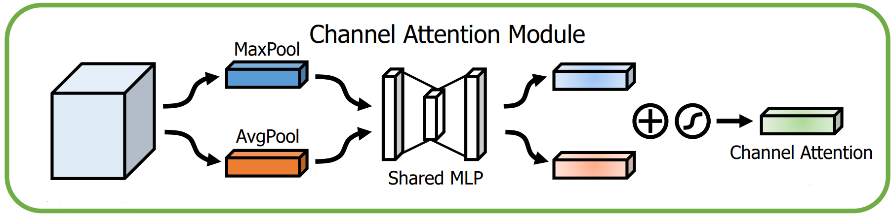

Figure 4.1. Demonstration of CBAM's channel attention module. Multiplication of the input by the attention vector is not shown. Image from figure 2 of <a href="#[39]">[39]</a>.

 


import torch									
from torch import nn
from torch.nn import functional as F

class CBAMChannelAttention(nn.Module):
	"""
	CBAM's channel attention module.

	Args:
		in_dim (int): Number of input channels.
		reduction_factor (int): Reduction factor for the 
		bottleneck layer.
		Default is 16.
	"""
	def __init__(
		self, 
		in_dim: int,
		reduction_factor: int = 16,
		) -> None:
		super().__init__()

		bottleneck_dim = in_dim//reduction_factor
		self.mlp = nn.Sequential(
			nn.Conv2d(
				in_channels=in_dim,
				out_channels=bottleneck_dim,
				kernel_size=1,
				),
			nn.ReLU(),
			nn.Conv2d(
				in_channels=bottleneck_dim,
				out_channels=in_dim,
				kernel_size=1,
				),
			)
	
	def forward(self, input: torch.Tensor) -> torch.Tensor:
		avg_pooled = F.adaptive_avg_pool2d(input, 1)
		max_pooled = F.adaptive_avg_pool2d(input, 1)

		avg_attention = self.mlp(avg_pooled)
		max_attention = self.mlp(max_pooled)
		
		attention = avg_attention+max_attention
		attention = F.sigmoid(attention)
		
		output = attention*input
		return output


Snippet 4.1.

 
Compared to average pooling alone, this version of channel attention attains better accuracy on ImageNet with a ResNet-50 (<a href="#table_4.1">table 4.1</a>).  

| **Channel attention** | **Top-1 accuracy** |
|------------------|--------------------|
| SE         | 76.86%             |
| CBAM's channel attention            | 77.20%             |

Table 4.1. Accuracy of SE versus CBAM's channel attention on ImageNet.

 
CBAM’s channel attention can also be tailored for spatial attention. To do so, the data is first average and max pooled along the channel axis; that is, rather than aggregating the activations of each channel, the activations of every spatial position \((j, k)\) are aggregated via pooling to get \(\bold Z_1 \isin \reals^{h \times w}\) and \(\bold Z_2 \isin \reals^{h \times w}\) (<a href="#equation_4.5">equations 4.5</a> and <a href="#equation_4.6">4.6</a>).

$$
\bold Z_{1_{j, k}} = \frac {1} {c} \sum_{i = 1} ^{c} X_{i,j,k}
$$

Equation 4.5. \(\forall j \isin {\{1, 2, ..., h\}}\), \(\forall k \isin {\{1, 2, ..., w\}}\).

 

$$
\bold Z_{2_{j, k}} = \max(X_{:,j,k})
$$

Equation 4.6. \(\forall j \isin {\{1, 2, ..., h\}}\), \(\forall k \isin {\{1, 2, ..., w\}}\).

 
\(\bold Z_1\) and \(\bold Z_2\) are concatenated to acquire a double-channelled tensor \(Z \isin \reals^{2 \times h \times w}\), which can be regarded as the equivalent of \(\bold z\) from SE or \(\bold z_1\) and \(\bold z_2\) from CBAM's channel attention. Therefore, the next step is to use this descriptor to capture spatial interactions and extract attention values. Naively, one might employ a multilayer perceptron, as has been the case with channel attention thus far, but owing to a few factors, an MLP would not be suitable for this task. First, for large feature maps early in the network, a fully-connected layer would be too inefficient due to its quadratic cost. Second, a fully-connected layer’s input dimension is static, meaning it cannot accept variable resolutions. Finally, it would have properties like variance to translation (i.e., a small shift in the input would wholly change the output) that are not suitable for spatial data.
  
Instead, convolutions would be more apposite; they are inexpensive, able to manage different resolutions, and have inductive biases such as invariance to translation that are appropriate for spatial data. Ergo, CBAM uses convolutions to model spatial dependencies without the defects of a multilayer perceptron (albeit one disadvantage is that the receptive field is confined to the kernel size and is not global).
  
An attention matrix \(\bold A \isin \reals^{h \times w}\) is extracted by running \(Z\) through a \(k\) x \(k\) convolutional layer with weight matrix \(W \bold \isin \reals^{1 \times 2 \times k \times k}\) and normalizing it with sigmoid (<a href="#equation_4.7">equation 4.7</a>). The strategy for calculating the output, \(\tilde{X} \isin \reals^{c \times h \times w}\), is similar to that of the channel attention module; each activation is multiplied by its attention value from \(\bold A \) (<a href="#equation_4.8">equation 4.8</a>).

$$
\bold A = \sigma (W * Z) 
$$

Equation 4.7. \( Z\) is typically padded beforehand to retain the spatial dimensions.
 

$$
\tilde{X}_{:, j, k} = \bold A_{j,k}X_{:,j,k}
$$

Equation 4.8. \(\forall j \isin {\{1, 2, ..., h\}}\), \(\forall k \isin {\{1, 2, ..., w\}}\).

 
<a href="#figure_4.2">Figure 4.2</a> depicts CBAM's spatial attention module, and it is implemented in <a href="#snippet_4.2">snippet 4.2</a>.  

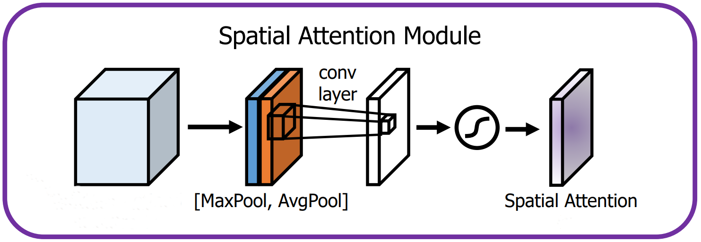

Figure 4.2. Demonstration of CBAM's spatial attention module. Ibid.

 


def channel_avg_pool(input: torch.Tensor) -> torch.Tensor:
	"""									
	Average pool along the channel axis.

	Args:
		input (torch.Tensor): Input to average pool.

	Returns (torch.Tensor): Input average pooled over the channel axis.
	"""
	return input.mean(dim=1, keepdim=True)

def channel_max_pool(input: torch.Tensor) -> torch.Tensor:
	"""
	Max pool along the channel axis.

	Args:
		input (torch.Tensor): Input to max pool.

	Returns (torch.Tensor): Input max pooled over the channel axis.
	"""
	return input.max(dim=1, keepdim=True).values

class CBAMSpatialAttention(nn.Module):
	"""
	CBAM's spatial attention.

	Args:
		kernel_size (int): Kernel size of the convolution.
		Default is 7.
	"""
	def __init__(
		self, 
		kernel_size: int = 7,
		) -> None:
		super().__init__()

		self.conv = nn.Conv2d(
			in_channels=2,
			out_channels=1,
			kernel_size=kernel_size,
			padding=kernel_size//2,
			)
	
	def forward(self, input: torch.Tensor) -> torch.Tensor:
		avg_pooled = channel_avg_pool(input)
		max_pooled = channel_max_pool(input)
		pooled = torch.cat([avg_pooled, max_pooled], dim=1)

		attention = self.conv(pooled)
		attention = F.sigmoid(attention)		
		
		output = attention*input
		return output


Snippet 4.2.
 
CBAM's channel and spatial attention modules are run sequentially to get CBAM (<a href="#snippet_4.3">snippet 4.3</a>).  


class CBAM(nn.Module):
	"""                                                            		
	Convolutional block attention module.

	Args:
		in_dim (int): Number of input channels.
		reduction_factor (int): Reduction factor for the 
		bottleneck layer of the channel attention module.
		Default is 16.
		kernel_size (int): Kernel size for the convolution 
		of the spatial attention module.
		Default is 7.
	"""
	def __init__(
		self, 
		in_dim: int,
		reduction_factor: int = 16,
		kernel_size: int = 7,
		) -> None:
		super().__init__()

		self.channel_attention = CBAMChannelAttention(
			in_dim=in_dim,
			reduction_factor=reduction_factor,
			)
		self.spatial_attention = CBAMSpatialAttention(kernel_size)
	
	def forward(self, input: torch.Tensor) -> torch.Tensor: 
		output = self.channel_attention(input)
		output = self.spatial_attention(output)
		return output


Snippet 4.3.

 
Experiments on ImageNet suggest that CBAM typically, though not always, outperforms SE with a host of backbones, including ResNet, ResNeXt, and MobileNet (<a href="#table_4.2">table 4.2</a>). Once again, CBAM is placed in every network block.  

| **Architecture**    | **Plain** | **With SE** | **With CBAM** |
|---------------------|-----------|-------------|---------------|
| ResNet-50           | 75.44%    | 76.86%      | 77.34%        |
| ResNet-101          | 76.62%    | 77.65%      | 78.49%        |
| ResNeXt-50          | 77.15%    | 78.09%      | 78.08%        |
| ResNeXt-101         | 78.46%    | 78.83%      | 78.93%        |
| MobileNet | 68.61%    | 70.03%      | 70.99%        |

Table 4.2. Top-1 accuracies of SE-based, CBAM-based, and vanilla convolutional neural networks on ImageNet.

---

# 5. Block Attention Module
Bottleneck attention module (BAM)[[23]](#[23]) was released concurrently with CBAM by the same researchers, and the overall philosophy remains unchanged (i.e., SE-esque channel attention plus spatial attention). BAM's channel attention module is nearly indistinguishable from SE, but batch normalization is applied before ReLU and, for reasons that shall be explained, sigmoid is left out. [Equation 5.1](#equation_5.1) describes how this unnormalized attention vector, \\(\bold a^′ \isin \reals^{c}\\), is calculated, with weight matrices \\(\bold W_{1} \isin \reals^{\frac {c} {r} \times c}\\) and \\(\bold W_{2} \isin \reals^{c \times \frac {c} {r}}\\), and [snippet 5.1](#snippet_5.1) implements it. The reader should note that this module returns the attention values and does not multiply them by the input.

$$
\bold a' = \bold W_{2} \delta (\textrm{BN}(\bold W_{1}\bold z))
$$

Equation 5.1.

 


import torch
from torch import nn
from torch.nn import functional as F

class BAMChannelAttention(nn.Module):
	"""                                         	                 	
	BAM's channel attention module.

	Args:
		in_dim (int): Number of input channels.
		reduction_factor (int): Reduction factor for the 
		bottleneck layer.
		Default is 16.
	"""
	def __init__(
		self, 
		in_dim: int,
		reduction_factor: int = 16,
		) -> None:
		super().__init__()

		bottleneck_dim = in_dim//reduction_factor
		self.mlp = nn.Sequential(
			nn.Conv2d(
				in_channels=in_dim,
				out_channels=bottleneck_dim,
				kernel_size=1,
				),
			nn.BatchNorm2d(bottleneck_dim),
			nn.ReLU(),
			nn.Conv2d(
				in_channels=bottleneck_dim,
				out_channels=in_dim,
				kernel_size=1,
				),
			)
	
	def forward(self, input: torch.Tensor) -> torch.Tensor:
		avg_pooled = F.adaptive_avg_pool2d(input, 1)
		attention = self.mlp(avg_pooled)
		return attention


Snippet 5.1.
 
BAM's spatial attention is more nuanced than that of CBAM. The first distinction is that instead of a large-kernelled convolution, two dilated \(3\) x \(3\) convolutions capture spatial interactions. Also, in lieu of pooling for compressing the channels, \(1\) x \(1\) convolutions are utilized. Lastly, this compression happens in two stages; specifically, the channels are initially reduced by a factor of \(r\), spatial relationships are modelled through the \(3\) x \(3\) convolutions, and the number of channels is shrunk a second time, this time to \(1\). Every convolution, other than the last one, is succeeded by batch normalization and ReLU. The mathematical expression for this module would be too involute, and the reader is directly referred to <a href="#snippet_5.2">snippet 5.2</a> instead. Again, an unnormalized attention matrix, \(\bold A' \isin \reals^{h \times w}\), is outputted.  


class BAMSpatialAttention(nn.Module):
	"""                                                          		
	BAM's spatial attention module.

	Args:
		in_dim (int): Number of input channels.
		reduction_factor (int): Reduction factor for the 
		bottleneck layer.
		Default is 16.
		dilation (int): Dilation for the 3 X 3 convolutions.
		Default is 4.
	"""
	def __init__(
		self, 
		in_dim: int,
		reduction_factor: int = 16,
		dilation: int = 4,
		) -> None:
		super().__init__()

		bottleneck_dim = in_dim//reduction_factor

		self.reduce_1 = nn.Sequential(
			nn.Conv2d(
				in_channels=in_dim,
				out_channels=bottleneck_dim,
				kernel_size=1,
				),
			nn.BatchNorm2d(bottleneck_dim),
			nn.ReLU(),
			)
		self.convs = nn.Sequential(
			*(2*[
			nn.Conv2d(
				in_channels=bottleneck_dim,
				out_channels=bottleneck_dim,
				kernel_size=3,
				padding=dilation,
				dilation=dilation,
				),
			nn.BatchNorm2d(bottleneck_dim),
			nn.ReLU()]),
			)
		self.reduce_2 = nn.Conv2d(
			in_channels=bottleneck_dim,
			out_channels=1,
			kernel_size=1,
			)
	
	def forward(self, input: torch.Tensor) -> torch.Tensor:
		attention = self.reduce_1(input)
		attention = self.convs(attention)
		attention = self.reduce_2(attention)
		return attention


Snippet 5.2.

 
To transform the input using the attention values and get the final output, \(\bold a'\) and \(\bold A'\) are element-wise multiplied by one another (after proper broadcasting) and normalized to get tensor \(A \isin \reals^{c \times h \times w}\) (<a href="#equation_5.2">equation 5.2</a>). The output, \(\tilde X \isin \reals^{c \times h \times w}\), is \(X\) multiplied by \(A + 1\) (<a href="#equation_5.3">equation 5.3</a>). BAM's implementation is included in <a href="#snippet_5.3">snippet 5.3</a>, and <a href="#figure_5.1">figure 5.1</a> illustrates this module.

$$
A_{i,j,k} = \sigma (\bold a'_{i} \bold A'_{j,k})
$$

Equation 5.2. \(\forall i \isin \{1, 2, ..., c\}\), \(j \isin \{1, 2, ..., h\}\), \(k \isin \{1, 2, ..., w\}\).

 

$$
\tilde X = X \odot (A + 1)
$$

Equation 5.3.

 


class BAM(nn.Module):
	"""
	Bottleneck attention module.

	Args:
		in_dim (int): Number of input channels.
		reduction_factor (int): Reduction factor for the bottleneck
		layers of the channel and spatial attention modules.
		Default is 16.
		dilation (int): Dilation for the 3 x 3 convolutions of the spatial
		attention module.
		Default is 4.
	"""
	def __init__(
		self, 
		in_dim: int,
		reduction_factor: int = 16,
		dilation: int = 4,
		) -> None:
		super().__init__()

		self.channel_attention = BAMChannelAttention(
			in_dim=in_dim,
			reduction_factor=reduction_factor,
			)
		self.spatial_attention = BAMSpatialAttention(
			in_dim=in_dim,
			reduction_factor=reduction_factor,
			dilation=dilation,
			)

	def forward(self, input: torch.Tensor) -> torch.Tensor:
		channel_attention = self.channel_attention(input)
		spatial_attention = self.spatial_attention(input)

		attention = channel_attention*spatial_attention
		attention = F.sigmoid(attention)
		attention = attention+1

		output = attention*input
		return output


Snippet 5.3.
 

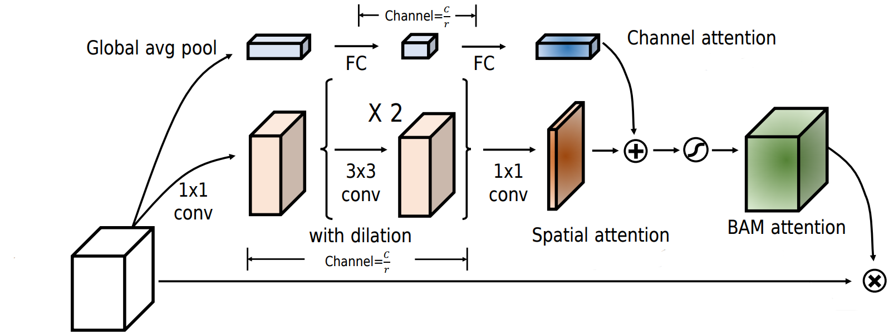

Figure 5.1. An overview of BAM. The strategy for fusing the channel and spatial attention maps is slightly different in this diagram - they are added and not multiplied. Image from figure 2 of <a href="#[23]">[23]<a>.
 
<a href="#table_5.1">Table 5.1</a> summarizes the top-1 accuracy of BAM with a few architectures.
Unlike SE, ECA, and CBAM, BAM is appended only after each network stage and is not present in every block. This table might mislead one into surmising BAM is inferior to SE and CBAM. Yet, across other tasks, datasets, and architectures, BAM is on par with CBAM, and there is no clear winner between the two.  

| **Architecture**    | **Plain** | **With SE** | **With CBAM** | **With BAM** |
|---------------------|-----------|-------------|---------------|---------------|
| ResNet-50           | 75.44%    | 76.86%      | 77.34%        | 75.98%        |
| ResNet-101          | 76.62%    | 77.65%      | 78.49%        | 77.56%        |
| ResNeXt-50          | 77.15%    | 78.09%      | 78.08%        | 77.15%        |
| MobileNet | 68.61%    | 70.03%      | 70.99%        | 69.42%        | 

Table 5.1. Top-1 accuracies of SE, CBAM, BAM, and vanilla networks on ImageNet.

---

# 6. Gather-Excite

Theoretically, the receptive fields of convolutional neural networks are sufficiently large to completely cover input images. However, the effective receptive field (ERF) of a network, that is, the actual size of its receptive field in practice, measured empirically, is much smaller and is not the same as its theoretical receptive field<a href="#[19]">[19]</a>. For example, the ERFs of CNNs of different depths with \\(3\\) x \\(3\\) kernels occupy only a fraction of their theoretical receptive fields, and this issue is exacerbated the deeper a network gets (<a href="#figure_6.1">figure 6.1</a>).  

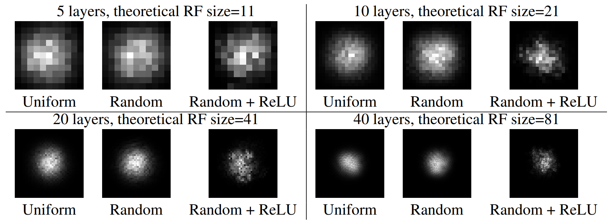

Figure 6.1. Effective versus theoretical receptive fields. The grids are the same size as the theoretical receptive fields, and the ERFs are depicted by bright pixels. The weights of the kernels are all \(1\)s for uniform and random values for random. Uniform and random do not contain non-linearities. Image from figure 1 of <a href="#[19]">[19]</a>.

 
Hence, spatially distant neurons do not communicate, thereby hindering neural networks’ performance on tasks where adequate long-range interactions are indispensable. <a href="#ge">[12]</a> suggests gather-excite (GE) to redress this problem. GE aggregates data from large spatial neighbourhoods via a function \(\xi G\), also known as the gather module, and redistributes the information back to every activation with another function \(\xi E\), also known as the excite module.  
In other words, the data is first spatially downsampled through \(\xi G\) so the resulting neurons contain information from activations that were previously distant and would normally not interact with one another. Then, \(\xi E\) redistributes the information of these neurons to the original activations to essentially force interactions amongst far-off pixels. <a href="#figure_6.2">Figure 6.2</a> provides an overview of GE.  

Figure 6.2. A high-level diagram of gather-excite. \(\xi G\) gathers information from the whitish, transparent squares on the leftmost figure to obtain the middle figure, and the values of the two are mixed through \(\xi E\).
Image from figure 1 of <a href="#[12]">[12]</a>.

 
This might sound unduly abstract, and a concrete example for input \(X \isin \reals^{c \times h \times w}\) would be helpful. \(\xi G\) can be average pooling with a kernel size of \(2e - 1\) and a stride of \(e\), where \(e\), also known as the extent, controls the size of the receptive field of \(\xi G\), whose output is \(Z \isin \reals^{c \times \frac {h} {e} \times \frac {w} {e}}\) (<a href="#equation_6.1">equation 6.1</a>). \(\xi E\) could simply upscale \(Z\) to the shape of the original input with nearest-neighbour interpolation and normalize it to get an attention tensor \(A \isin \reals^{c \times h \times w}\) (<a href="#equation_6.2">equation 6.2</a>). Akin to the other attention mechanisms, \(A\) is element-wise multiplied by the original input to get \(\tilde X \isin \reals^{c \times h \times w}\), the final output (<a href="#equation_6.3">equation 6.3</a>). A special case of this is when \(\xi G\) is <i>global</i> average pooling, in which case it would be equivalent to SE-Var-1 from the efficient channel attention paper. By convention, \(e\) is set to \(0\) to signify global pooling.

$$
Z = \xi G(X) = \textrm{AvgPool}(X; \textrm{kernel size}=2e-1, \textrm{stride}=e)
$$

Equation 6.1. Padding is also applied to ensure the spatial dimensions are downsampled exactly by a factor of \(e\).

 

$$
A = \sigma(\textrm{Interpolate}(Z))
$$

Equation 6.2. The target size of interpolation is \(h \times w\).

 

$$
\tilde X = X \odot A
$$

Equation 6.3.

 
This parameter-free rudimentary module, implemented in <a href="#snippet_6.1">snippet 6.1</a>, is called GE-θ- (θ- symbolizes the lack of parameters) and consistently improves the performance of ResNet-50 on ImageNet when added to every residual block (<a href="#table_6.1">table 6.1</a>). Importantly, the larger the extent, the better the accuracy, a trend that indicates the value of long-range interactions.  


import torch
from torch import nn                                                          
from torch.nn import functional as F

class GENoParams(nn.Module):
	"""
	Gather-excite with no parameters.

	Args:
		extent (int): Extent. 0 for a global 
		extent.
	"""
	def __init__(
		self,
		extent: int,
		) -> None:
		super().__init__()

		if extent == 0:
			self.gather = nn.AdaptiveAvgPool2d(1)

		else:
			kernel_size = 2*extent - 1
			self.gather = nn.AvgPool2d(
				kernel_size=kernel_size,
				stride=extent,
				padding=kernel_size//2,
				count_include_pad=False,
				)

	def forward(self, input: torch.Tensor) -> torch.Tensor:
		gathered = self.gather(input)
		attention = F.interpolate(
			input=gathered,
			size=input.shape[-2:],
			mode='nearest',
			)
		attention = F.sigmoid(attention)

		output = attention*input
		return output


Snippet 6.1.
 

| **Extent** | **Top-1 accuracy** |
|------------------|--------------------|
| Original         | 76.71%             |
| 2            | 76.89%             |
| 4            | 77.13%             |
| 8            | 77.60%             |
| Global            | 77.86%             |

Table 6.1. Accuracy of GE-θ- with various extents, as well as a plain ResNet-50, on ImageNet.

 
Naturally, parameterizing GE-θ- should further help, so the authors decide to supplant average pooling in \(\xi G\) with convolutions to get GE-θ. Specifically, \(3\) x \(3\) depthwise convolutions with strides of \(2\) are used to downsample the input, where the number of convolutions is \(\log_2(e)\) to ensure the input is downsampled by a factor of \(e\). For a global extent, a single depthwise convolution with a kernel size of \(h \times w\) is used. Batch normalization is also appended after each convolution, and for non-global extents, ReLU is also used. GE-θ is implemented in <a href="#snippet_6.2">snippet 6.2</a> and outperforms GE-θ- (<a href="#table_6.2">table 6.2</a>).  


from math import log2
from typing import Optional, Tuple, Union

import torch
from torch import nn                                                          
from torch.nn import functional as F

class GEParams(nn.Module):
	"""
	Gather-excite with parameters.
	
	Args:
		in_dim (int): Number of input channels.
		extent (int): Extent. 0 for a global
		extent.
		spatial_dim (Optional[Union[Tuple[int, int], int]]):
		Spatial dimension of the input, required for a global 
		extent.
		Default is None.
	"""
	def __init__(
		self,
		in_dim: int,
		extent: int,
		spatial_dim: Optional[Union[Tuple[int, int], int]] = None,
		) -> None:
		super().__init__()

		if extent == 0:
			self.gather = nn.Sequential(
				nn.Conv2d(
					in_channels=in_dim,
					out_channels=in_dim,
					kernel_size=spatial_dim,
					groups=in_dim,
					bias=False,
					),
				nn.BatchNorm2d(in_dim),
				)

		else:
			n_layers = int(log2(extent))
			layers = n_layers * [
				nn.Conv2d(
					in_channels=in_dim,
					out_channels=in_dim,
					kernel_size=3,
					stride=2,
					padding=1,
					groups=in_dim,
					bias=False,
					),
				nn.BatchNorm2d(in_dim),
				nn.ReLU(),
				]
			layers = layers[:-1]
			self.gather = nn.Sequential(*layers)

	def forward(self, input: torch.Tensor) -> torch.Tensor:
		gathered = self.gather(input)
		attention = F.interpolate(
			input=gathered,
			size=input.shape[-2:],
			mode='nearest',
			)
		attention = F.sigmoid(attention)

		output = attention*input
		return output


Snippet 6.2.
 

| **Extent** | **GE-θ-** | **GE-θ** |
|------------------|--------------------|--------------------|
| 2            | 76.89%             | 77.29%             |
| 4            | 77.13%             | 77.81%             |
| 8            | 77.60%             | 77.87%             |
| Global            | 77.86%             | 78.00%             |

Table 6.2. Top-1 accuracies of GE-θ- and GE-θ with several extents on ImageNet with ResNet-50.

 
Encouraged by the potency of a parameterized gather unit, the authors also parameterize \(\xi E\). Particularly, it is replaced by the excitation module from SE, i.e., a multilayer perceptron, with  \(W_{1} \isin \reals^{\frac {c} {r} \times c \times 1 \times 1}\) and \(W_{2} \isin \reals^{c \times \frac {c} {r} \times 1 \times 1}\) as its parameters and \(r\) the reduction factor, followed by interpolation and sigmoid (<a href="#equation_6.4">equation 6.4</a>). Since the spatial shape of the input is not necessarily \(1\) x \(1\), \(W_1\) and \(W_2\) cannot always be linear layers and are instead \(1\) x \(1\) convolutions. 

$$
\xi E(Z; \bold W_1, \bold W_2) =  \sigma(\textrm{Interpolate}((W_{2} * \delta (W_{1} * Z))))
$$

Equation 6.4. Whether sigmoid or interpolation is applied first is unimportant.

 
This final iteration of GE, implemented in <a href="#snippet_6.3">snippet 6.3</a>, is named GE-θ+, and it combines a parameterized gather unit with a parameterized excite unit. With ResNet-50, ResNet-101, and ShuffleNet, GE-θ+ surpasses GE-θ-, GE-θ, and SE (<a href="#table_6.3">table 6.3</a>).  


from math import log2
from typing import Optional, Tuple, Union

import torch
from torch import nn                                                          
from torch.nn import functional as F

class GEParamsPlus(nn.Module):
	"""
	Gather-excite with parameters, including for the excite unit.

	Args:
		in_dim (int): Number of input channels.
		extent (int): Extent. 0 for a global
		extent.
		reduction_factor (int): Reduction factor for the 
		bottleneck layer of the excite module.
		Default is 16.
		spatial_dim (Optional[Union[Tuple[int, int], int]]):
		Spatial dimension of the input, required for a global 
		extent.
		Default is None.
	"""
	def __init__(
		self,
		in_dim: int,
		extent: int,
		reduction_factor: int = 16,
		spatial_dim: Optional[Union[Tuple[int, int], int]] = None,
		) -> None:
		super().__init__()

		if extent == 0:
			self.gather = nn.Sequential(
				nn.Conv2d(
					in_channels=in_dim,
					out_channels=in_dim,
					kernel_size=spatial_dim,
					groups=in_dim,
					bias=False,
					),
				nn.BatchNorm2d(in_dim),
				)

		else:
			n_layers = int(log2(extent))
			layers = n_layers * [
				nn.Conv2d(
					in_channels=in_dim,
					out_channels=in_dim,
					kernel_size=3,
					stride=2,
					padding=1,
					groups=in_dim,
					bias=False,
					),
				nn.BatchNorm2d(in_dim),
				nn.ReLU(),
				]
			layers = layers[:-1]
			self.gather = nn.Sequential(*layers)
		
		bottleneck_dim = in_dim//reduction_factor
		self.mlp = nn.Sequential(
			nn.Conv2d(
				in_channels=in_dim,
				out_channels=bottleneck_dim,
				kernel_size=1,
				),
			nn.ReLU(),
			nn.Conv2d(
				in_channels=bottleneck_dim,
				out_channels=in_dim,
				kernel_size=1,
				),
			)
	
	def forward(self, input: torch.Tensor) -> torch.Tensor:
		gathered = self.gather(input)
		attention = self.mlp(gathered)
		attention = F.interpolate(
			input=attention,
			size=input.shape[-2:],
			)
		attention = F.sigmoid(attention)

		output = attention*input
		return output


Snippet 6.3.
 

| **Architecture** | **Plain** | **SE** | **GE-θ-** | **GE-θ** | **GE-θ+** |
|------------------|--------------------|--------------------|------------------|------------------|------------------|
| ResNet-50            | 76.70%             | 77.88%             | 77.86%             | 78.00%             | 78.12%             |
| ResNet-101            | 77.80%             | 79.06%             | 78.53%             | 78.54%             | 79.26%             |
| ShuffleNet            | 67.40%             | 68.76%             | N.A.             | 68.20%             | 69.88%             |

Table 6.3. Top-1 accuracies of GE modules (with global extents) and SE with a few backbones on ImageNet. The accuracy of GE-θ- with ShuffleNet was not reported.

---

# 7. Selective Kernel
Convolutional neural networks, since their nascent days, have been inspired by biological neurons in the primary visual cortex (V1) and aim to mimic the vision processing of animals. Kunihiko Fukushima, for example, developed the neocognitron in 1980<a href="#[8]">[8]</a>, a primitive archetype of CNNs that was based on the research of David Hubel and Torsten Wiesel on simple and complex cells ubiquitous in the V1<a href="#[13]">[13]</a>. Simple cells detect bar-like shapes of particular orientations (e.g., edges), whereas complex cells are composed of several simple cells and exhibit properties such as spatial invariance and recognition of more complex patterns like polygons.

Similarly, the Inception family of architectures<a href="#[31]">[31]</a><a href="#[32]">[32]</a><a href="#[30]">[30]</a> collects multi-scale information from images using convolutions of various kernel sizes to be faithful to the fact that the receptive field sizes of nearby neurons in the visual cortex might differ (<a href="#figure_7.1">figure 7.1</a>). Notwithstanding, Inception models fail to address a key ingredient of neurons in the V1, namely, how the receptive field size is adjusted according to the stimulus and is not static<a href="#[28]">[28]</a>.  

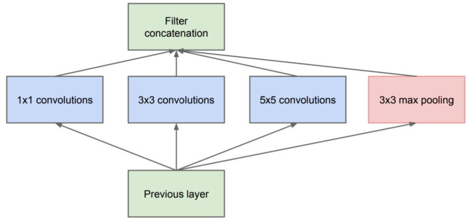

Figure 7.1. A typical Inception block with multple kernel sizes. Image from figure 2 of <a href="#[31]">[31]</a>.

 

The selective kernel (SK)<a href="#[18]">[18]</a> module is designed to bridge this gap and is intended as a drop-in replacement for traditional convolutions with fixed kernel sizes. It contains multiple branches of different kernel sizes whose outputs are aggregated through an attention mechanism so more weight is assigned to branches with kernel sizes relevant to the current input.

SK's first constituent is _split_, where the goal is to transform the data via multiple branches, each with a convolutional layer of a different kernel size (<a href="#figure_7.2">figure 7.2</a>). For input \\(X \isin \reals^{c \times h \times w}\\) and two as the number of branches, there would be two convolutional layers, kernel sizes \\(3\\) x \\(3\\) and \\(5\\) x \\(5\\), with weights \\(W_1 \isin \reals^{c \times c \times 3 \times 3}\\) and \\(W_2 \isin \reals^{c \times c \times 5 \times 5}\\). They convolve over \\(X\\), followed by batch normalization modules and ReLU, to obtain \\(U_1 \isin \reals^{c \times h \times w}\\) and \\(U_2 \isin \reals^{c \times h \times w}\\). More generally, the output of branch \\(l\\), with \\(m\\) as the number of branches, is calculated by convolving over \\(X\\) with \\(W_{l}\\) and applying batch normalization and ReLU (<a href="#equation_7.1">equation 7.1</a>).  

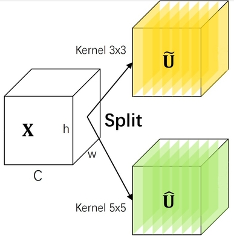

Figure 7.2. The first step of SK, split. \(\tilde U\) and \(\hat U\) correspond to \(U_1\) and \(U_2\). Image from figure 1 of <a href="#[18]">[18]</a>.

 

$$
U_{l} = \delta (\textrm{BN}(W_{l} * X))
$$

Equation 7.1.

 
The implementation of this component of SK, found in <a href="#snippet_7.1">snippet 7.1</a>, slightly differs from the diagram and description above, in that rather than increasing the kernel size, the dilation value is incremented, and the kernel size is kept at \(3\) x \(3\) for efficiency. For instance, in place of a \(5\) x \(5\) convolution, a \(3\) x \(3\) convolution with a dilation value of \(2\) is used. Also, since SK is branded as a replacement for regular convolutions, it must accept common arguments such as group size or stride.   


import torch                                                          
from torch import nn
from torch.nn import functional as F

class Branch(nn.Module):
	"""
	A branch for SK's split module.

	Args:
		in_dim (int): Number of input channels.
		out_dim (int): Number of output channels.
		kernel_size (int): Kernel size. The actual kernel size
		is fixed at 3, but the dilation value is increased to simulate
		larger kernel sizes.
		Default is 3.
		stride (int): Stride.
		Default is 1.
		groups (int): Number of groups.
		Default is 32.
	"""
	def __init__(
		self,
		in_dim: int,
		out_dim: int,
		kernel_size: int = 3,
		stride: int = 1,
		groups: int = 32,
		) -> None:
		super().__init__()

		self.conv = nn.Conv2d(
			in_channels=in_dim,
			out_channels=out_dim,
			kernel_size=3,
			stride=stride,
			padding=kernel_size//2,
			dilation=(kernel_size-1)//2,
			groups=groups,
			bias=False,
			)
		self.bn = nn.BatchNorm2d(out_dim)
		self.relu = nn.ReLU()
	
	def forward(self, input: torch.Tensor) -> torch.Tensor:
		output = self.conv(input)
		output = self.bn(output)
		output = self.relu(output)
		return output

class Split(nn.Module):
	"""
	SK's split module.

	Args:
		in_dim (int): Number of input channels.
		out_dim (int): Number of output channels.
		n_branches (int): Number of branches.
		Default is 2.
		stride (int): Stride for each branch.
		Default is 1.
		groups (int): Number of groups for each branch.
		Default is 32.
	"""
	def __init__(
		self,
		in_dim: int,
		out_dim: int,
		n_branches: int = 2,
		stride: int = 1,
		groups: int = 32,
		) -> None:
		super().__init__()

		branches = []
		for i in range(1, n_branches+1):
			branch = Branch(
				in_dim=in_dim,
				out_dim=out_dim,
				kernel_size=2*i + 1,
				stride=stride,
				groups=groups,
				)
			branches.append(branch)
		self.branches = nn.ModuleList(branches)
	
	def forward(self, input: torch.Tensor) -> torch.Tensor:
		outputs = []
		for branch in self.branches:
			output = branch(input)
			outputs.append(output)
		output = torch.stack(outputs, dim=1)
		return output


Snippet 7.1. The output of <code>Split</code> has a new axis of size \(2\) at dimension \(1\), representing the two branches.
 
Next, the information from \(U_1\) and \(U_2\) need to be fused together into a vector, which shall later be used to calculate attention values. To do so, \(U_1\) and \(U_2\) are first summed to get \(U \isin \reals^{c \times h \times w}\) (<a href="#equation_7.2">equation 7.2</a>) and global average pooling over \(U\) is performed to get vector \(\bold s \isin \reals^{c}\) (<a href="#equation_7.3">equation 7.3</a>). Then, another vector \(\bold z \isin \reals^{\frac {c} {r}}\) is extracted through transforming \(\bold s\) via a linear layer with weight matrix \(\bold W \isin \reals^{\frac {c} {r} \times c}\), followed by batch normalization and ReLU (<a href="#equation_7.4">equation 7.4</a>).  

$$
U = \sum_{l=1} ^ {m} U_{l}
$$

Equation 7.2.
 

$$
\bold s_{i} = \frac {1} {hw} \sum_{j = 1} ^{h} \sum_{k = 1} ^{w} U_{i,j,k}
$$

Equation 7.3. \(\forall i \isin {\{1, 2, ..., c\}}\).

 

$$
\bold z = \delta(\textrm{BN}(\bold W \bold s))
$$

Equation 7.4.

 
This step, known as <i>fuse</i>, is depicted in <a href="#figure_7.3">figure 7.3</a> and implemented in <a href="#snippet_7.2">snippet 7.2</a>.  

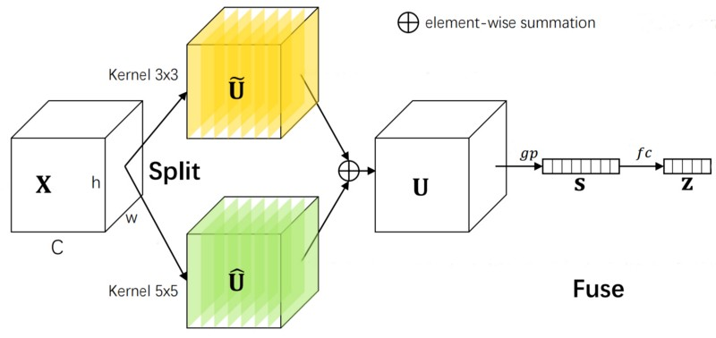

Figure 7.3. Split and fuse from SK. Ibid.

 


from torch.nn import functional as F						

class Fuse(nn.Module):
	"""
	SK's fuse module.

	Args:
		in_dim (int): Number of channels in each branch.
		reduction_factor (int): Reduction factor for the 
		fully-connected layer.
		Default is 16.
	"""
	def __init__(
		self,
		in_dim: int,
		reduction_factor: int = 16
		) -> None:
		super().__init__()
		
		reduced_dim = in_dim//reduction_factor
		self.fc = nn.Sequential(
			nn.Conv2d(
				in_channels=in_dim,
				out_channels=reduced_dim,
				kernel_size=1,
				bias=False,
				),
			nn.BatchNorm2d(reduced_dim),
			nn.ReLU(),
			)
	
	def forward(self, input: torch.Tensor) -> torch.Tensor:
		summed = input.sum(1)
		avg_pooled = F.adaptive_avg_pool2d(summed, 1)
		output = self.fc(avg_pooled)
		return output


Snippet 7.2.
 
Lastly, SK's <i>select</i> module calculates attention vectors for every branch using \(\bold z\). Particularly, for branch \(l\), there is a weight matrix \(\bold W_{l} \isin \reals^{c \times \frac {c} {r}}\) that transforms  \(\bold z\) into an unnormalized attention vector \(\bold a'_{l} \isin \reals^{c}\) (<a href="#equation_7.5">equation 7.5</a>). Subsequently, the softmax function is applied along the branch axis to get normalized attention vectors for every branch, namely, \(\bold a_{l} \isin \reals^{c}\) (<a href="#equation_7.6">equation 7.6</a>). The original output of each branch is multiplied by its attention vector, and the results across all branches are summed to get the final output \(\tilde X \isin \reals^{c \times h \times w}\) (<a href="#equation_7.7">equation 7.7</a>). It should be noted SK is not weighing each branch coarsely, that is, it is not merely assigning a single attention score to every branch; rather, it is computing attention values for every channel of each branch. Consequently, it is an attention mechanism that operates over channels as well as branches and can adapt the kernel size of each channel individually, e.g., half the input's channels might be processed with a kernel size of \(3\) x \(3\), and the rest are processed with a kernel size of \(5\) x \(5\).

$$
\bold a'_{l} = \bold W_{l} \bold z
$$

Equation 7.5.

 

$$
\bold a_{l} = \frac {e^{\bold a_{l}}} {\sum_{l'=1} ^ m e^{\bold a_{l'}}}
$$

Equation 7.6. The element-wise exponential of each vector is taken.

 

$$
\tilde X_{i,j,k} = \sum_{l=1} ^ {m} \bold a_{l_{i}}U_{l_{i,j,k}}
$$

Equation 7.7. \(\forall i \isin {\{1, 2, ..., c\}}, \forall j \isin {\{1, 2, ..., h\}}, \forall k \isin {\{1, 2, ..., w\}}\).

 
The select unit and the complete version of SK are depicted in <a href="#figure_7.4">figure 7.4</a> and implemented in <a href="#snippet_7.3">snippet 7.3</a>. Some readers may have discerned resemblances between squeeze-and-excitation and the fuse & select components of SK. As mentioned, SK also captures channel interactions and in fact, SK with a single branch is simply SE.  

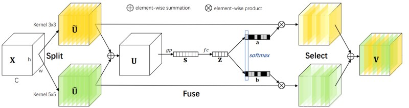

Figure 7.4. \(\bold a\) and \(\bold b\) are \(\bold a_1\) and \(\bold a_2\). Ibid.

 


class Select(nn.Module):
	"""
	SK's select module.

	Args:
		in_dim (int): Number of channels in each branch.
		n_branches (int): Number of branches.
		Default is 2.
		reduction_factor (int): Reduction factor for the 
		fully-connected layer of the fuse module.
		Default is 16.
	"""
	def __init__(
		self,
		in_dim: int,
		n_branches: int = 2,
		reduction_factor: int = 16
		) -> None:
		super().__init__()

		self.fc = nn.Conv2d(
			in_channels=in_dim//reduction_factor,
			out_channels=n_branches*in_dim,
			kernel_size=1,
			bias=False,
			)
		self.softmax = nn.Softmax(dim=1)
	
	def forward(self, input: torch.Tensor, z: torch.Tensor) -> torch.Tensor:
		batch_size, n_branches, in_dim, height, width = input.shape

		attention = self.fc(z)
		attention = attention.reshape(batch_size, n_branches, in_dim, 1, 1)
		attention = self.softmax(attention)

		output = attention*input
		output = output.sum(1)
		return output

class SK(nn.Module):
	"""
	Selective kernel module.

	Args:
		in_dim (int): Number of input channels.
		out_dim (int): Number of output channels.
		n_branches (int): Number of branches.
		Default is 2.
		stride (int): Stride for each branch.
		Default is 1.
		groups (int): Number of groups for each branch.
		Default is 32.
		reduction_factor (int): Reduction factor for the 
		fully-connected layer for the fuse module.
		Default is 16.
	"""
	def __init__(
		self,
		in_dim: int,
		out_dim: int,
		n_branches: int = 2,
		stride: int = 1,
		groups: int = 32,
		reduction_factor: int = 16
		) -> None:
		super().__init__()

		self.split = Split(
			in_dim=in_dim,
			out_dim=out_dim,
			n_branches=n_branches,
			stride=stride,
			groups=groups,
			)
		self.fuse = Fuse(
			in_dim=out_dim,
			reduction_factor=reduction_factor,
			)
		self.select = Select(
			in_dim=out_dim,
			n_branches=n_branches,
			reduction_factor=reduction_factor,
			)
	
	def forward(self, input: torch.Tensor) -> torch.Tensor:
		branches = self.split(input)
		z = self.fuse(branches)
		output = self.select(branches, z)
		return output


Snippet 7.3. In the select unit, <code>self.fc</code> is equivalent to \(m\) distinct linear layers.
 
\(3\) x \(3\) convolutions in regular CNNs are replaced with SK modules consisting of two branches to test the performance of this layer. Experiments with ResNeXt and ShuffleNetV2 corroborate the power of SK and adaptive receptive field sizes (<a href="#table_7.1">table 7.1</a>).  

| **Architecture** | **Plain** | **With SE** | **With SK** |
|------------------|-----------|-------------|-------------|
| ResNeXt-50       | 77.77%    | 78.88%      | 79.21%      |
| ResNeXt-101      | 78.89%    | 79.42%      | 79.81%      |
| ShuffleNetV2     | 69.43%    | 70.53%      | 71.64%      |

Table 7.1. Top-1 accuracies of plain networks, with SE, SK, or neither, on ImageNet.

---

# 8. Split Attention

In selective kernel networks, the split unit contains several branches of various kernel sizes, similar to how ResNeXt is compromised of multiple paths, and the fuse and select components adopt an SE-like mechanism to adaptively aggregate the output of each branch. Hence, SK compounds the success of multi-branch architectures like ResNeXt and that of channel attention mechanisms like squeeze-and-excitation to benefit from the best of both worlds.

Split attention (SplAt)[[44]](#[44]) follows in the footsteps of SK and amalgamates multi-branch modules with channel attention for better performance. In the simplest scenario, it is almost indistinguishable from SK, and their sole disparity lies in how SplAt's branches behave. Specifically, all of SplAt's branches share the same kernel size, and instead of receiving and outputting \\(c\\) channels for input \\(X \isin \reals^{c \times h \times w}\\), each branch gets a subsection of the input with \\(\frac {c} {r}\\) channels and outputs \\(c\\) channels. \\(r\\), known as the _radix_, can be thought of as the number of branches of SplAt in this case.

For instance, for input \\(X \isin \reals^{64 \times h \times w}\\) and a radix of \\(2\\), SplAt first divides the input, along the channel dimension, into \\(2\\) non-overlapping segments \\(X_1 \isin \reals^{32 \times h \times w}\\) and  \\(X_2 \isin \reals^{32 \times h \times w}\\). There are two \\(3\\) x \\(3\\) convolutions, with weight tensors \\(W_1 \isin \reals^{64 \times 32 \times 3 \times 3}\\) and \\(W_2 \isin \reals^{64 \times 32 \times 3 \times 3}\\), that are applied to \\(X_1\\) and \\(X_2\\), followed by batch normalization and ReLU, to obtain \\(U_1 \isin \reals^{64 \times h \times w}\\) and \\(U_2 \isin \reals^{64 \times h \times w}\\) (<a href="#equation_8.1">equation 8.1</a> and <a href="#figure_8.1">figure 8.1</a>), with the rest of the process being identical to SK, i.e., the branches are summed and average pooled, and an MLP generates attention values used to calculate a weighted average of \\(U_1\\) and \\(U_2\\). From an implementation perspective, the input need not be split into two moieties, and a convolution with a group size of \\(2\\) would suffice (<a href="#snippet_8.1">snippet 8.1</a>).

$$
U_{l} = \delta (\textrm{BN}(W_{l} * X_{l}))
$$

Equation 8.1. Output of branch \(l\).
 

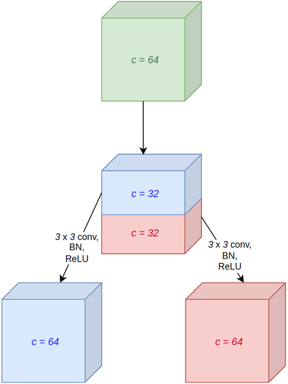

Figure 8.1. An overview of SplAt's branches. Image by the author.
 


from torch import Tensor                                                          
import torch
from torch import nn

class Branches(nn.Module):
	"""
	SplAt's branches.

	Args:
		in_dim (int): Number of input channels.
		out_dim (int): Number of output channels.
		kernel_size (int): Kernel size.
		Default is 3.
		stride (int): Stride.
		Default is 1.
		radix (int): Radix.
		Default is 2.
	"""
	def __init__(
		self,
		in_dim: int,
		out_dim: int,
		kernel_size: int = 3,
		stride: int = 1,
		radix: int = 2,
		) -> None:
		super().__init__()

		self.radix = radix

		branches_out_dim = radix*out_dim
		self.branches = nn.Sequential(
			nn.Conv2d(
				in_channels=in_dim,
				out_channels=branches_out_dim,
				kernel_size=kernel_size,
				stride=stride,
				padding=kernel_size//2,
				groups=radix,
				bias=False,
				),
			nn.BatchNorm2d(branches_out_dim),
			nn.ReLU(),
			)
	
	def forward(self, input: torch.Tensor) -> torch.Tensor:
		batch_size, in_dim, height, width = input.shape
		output = self.branches(input)
		output = output.reshape(batch_size, self.radix, -1, height, width)
		return output

class SplAt(nn.Module):
	"""
	Split attention.

	Args:
		in_dim (int): Number of input channels.
		out_dim (int): Number of output channels.
		kernel_size (int): Kernel size.
		Default is 3.
		stride (int): Stride.
		Default is 1.
		radix (int): Radix.
		Default is 2.
		reduction_factor (int): Reduction factor for the 
		fully-connected layer.
		Default is 4.
	"""
	def __init__(
		self,
		in_dim: int,
		out_dim: int,
		kernel_size: int = 3,
		stride: int = 1,
		radix: int = 2,
		reduction_factor: int = 4,
		) -> None:
		super().__init__()

		self.stride = stride
		self.radix = radix

		branches_out_dim = radix*out_dim
		reduced_dim = branches_out_dim//reduction_factor
		self.branches = Branches(
			in_dim=in_dim,
			out_dim=out_dim,
			kernel_size=kernel_size,
			stride=stride,
			radix=radix,
			)
		self.avg_pool = nn.AdaptiveAvgPool2d(1)
		self.mlp = nn.Sequential(
			nn.Conv2d(
				in_channels=out_dim,
				out_channels=reduced_dim,
				kernel_size=1,
				bias=False,
				),
			nn.BatchNorm2d(reduced_dim),
			nn.ReLU(),
			nn.Conv2d(
				in_channels=reduced_dim,
				out_channels=branches_out_dim,
				kernel_size=1,
				)
			)
		self.gate = nn.Softmax(dim=1) if 1 < radix else nn.Sigmoid()
	
	def forward(self, input: torch.Tensor) -> torch.Tensor:
		batch_size = len(input)

		branches_output = self.branches(input)
		branches_summed = branches_output.sum(1)
		avg_pooled = self.avg_pool(branches_summed)
		
		attention = self.mlp(avg_pooled)
		attention = self.gate(attention)
		attention = attention.reshape(batch_size, self.radix, -1, 1, 1)
		
		output = attention*branches_output
		output = output.sum(1)
		return output


Snippet 8.1. <code>Branches</code> corresponds to SK's split module. SK's implementation could have been reused, but SplAt does not employ the split-fuse-select terminology, and thus it is not used here either. Sigmoid is used instead of softmax for \(r = 1\).

 
Although this version of SplAt (which shall be referred to as SplAt-0 in this article) is a multi-branch module, it can be applied separately to subgroups of the input, called cardinal groups, for better accuracy. Concretely, for, e.g., \(4\) cardinal groups, the data is quartered into four splits, which are transformed separately by SplAt-0 and their results thereupon concatenated along the channel dimension to get the final output. This is the full version of SplAt and is shown in <a href="#figure_8.2">figure 8.2</a>.  

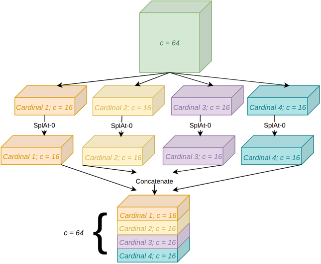

Figure 8.2. Split attention with several cardinal groups. Ibid.
 
SplAt's code is nearly identical to that of SplAt-0: By multiplying the group size of every convolution by the desired cardinality, each cardinal group would effectively be processed separately, with no communication amongst them. However, softmax must be applied individually to every cardinal group, which is achieved by constructing two new axes, one corresponding to the radix and the other to the cardinality, and applying softmax along the former dimension. <a href="#snippet_8.2">Snippet 8.2</a> implements SplAt.  


import torch
from torch import nn                                                          

class Branches(nn.Module):
	"""
	SplAt's branches.

	Args:
		in_dim (int): Number of input channels.
		out_dim (int): Number of output channels.
		kernel_size (int): Kernel size.
		Default is 3.
		stride (int): Stride.
		Default is 1.
		cardinality (int): Cardinality.
		Default is 1.
		radix (int): Radix.
		Default is 2.
	"""
	def __init__(
		self,
		in_dim: int,
		out_dim: int,
		kernel_size: int = 3,
		stride: int = 1,
		cardinality: int = 1,
		radix: int = 2,
		) -> None:
		super().__init__()

		self.radix = radix

		branches_out_dim = radix*out_dim
		self.branches = nn.Sequential(
			nn.Conv2d(
				in_channels=in_dim,
				out_channels=branches_out_dim,
				kernel_size=kernel_size,
				stride=stride,
				padding=kernel_size//2,
				groups=cardinality*radix,
				bias=False,
				),
			nn.BatchNorm2d(branches_out_dim),
			nn.ReLU(),
			)
	
	def forward(self, input: torch.Tensor) -> torch.Tensor:
		batch_size, in_dim, height, width = input.shape
		output = self.branches(input)
		output = output.reshape(batch_size, self.radix, -1, height, width)
		return output

class RadixSoftmax(nn.Module):
	"""
	Softmax applied over the radix dimension.

	Args:
		cardinality (int): Cardinality.
		Default is 1.
		radix (int): Radix. If 1, sigmoid is applied.
		Default is 2.
	"""
	def __init__(
		self,
		cardinality: int = 1,
		radix: int = 2,
		) -> None:
		super().__init__()

		self.radix = radix
		self.cardinality = cardinality

		if radix == 1:
			self.gate = nn.Sigmoid()
		
		else:
			self.gate = nn.Softmax(dim=1)
	
	def forward(self, input: torch.Tensor) -> torch.Tensor:
		batch_size, in_dim, height, width = input.shape

		output = input.reshape(batch_size, self.cardinality, self.radix, -1)
		output = output.transpose(1, 2)
		output = self.gate(output)
		return output

class SplAt(nn.Module):
	"""
	Split attention.

	Args:
		in_dim (int): Number of input channels.
		out_dim (int): Number of output channels.
		kernel_size (int): Kernel size.
		Default is 3.
		stride (int): Stride.
		Default is 1.
		cardinality (int): Cardinality.
		Default is 1.
		radix (int): Radix.
		Default is 2.
		reduction_factor (int): Reduction factor for the 
		fully-connected layer.
		Default is 4.
	"""
	def __init__(
		self,
		in_dim: int,
		out_dim: int,
		kernel_size: int = 3,
		stride: int = 1,
		cardinality: int = 1,
		radix: int = 2,
		reduction_factor: int = 4,
		) -> None:
		super().__init__()

		self.stride = stride
		self.radix = radix

		branches_out_dim = radix*out_dim
		reduced_dim = branches_out_dim//reduction_factor
		self.branches = Branches(
			in_dim=in_dim,
			out_dim=out_dim,
			kernel_size=kernel_size,
			stride=stride,
			cardinality=cardinality,
			radix=radix,
			)
		self.avg_pool = nn.AdaptiveAvgPool2d(1)
		self.mlp = nn.Sequential(
			nn.Conv2d(
				in_channels=out_dim,
				out_channels=reduced_dim,
				kernel_size=1,
				groups=cardinality,
				bias=False,
				),
			nn.BatchNorm2d(reduced_dim),
			nn.ReLU(),
			nn.Conv2d(
				in_channels=reduced_dim,
				out_channels=branches_out_dim,
				kernel_size=1,
				groups=cardinality,
				)
			)
		self.radix_softmax = RadixSoftmax(
			cardinality=cardinality,
			radix=radix,
			)
	
	def forward(self, input: torch.Tensor) -> torch.Tensor:
		batch_size = len(input)

		branches_output = self.branches(input)
		branches_summed = branches_output.sum(1)
		avg_pooled = self.avg_pool(branches_summed)
		
		attention = self.mlp(avg_pooled)
		attention = self.radix_softmax(attention)
		attention = attention.reshape(batch_size, self.radix, -1, 1, 1)
		
		output = attention*branches_output
		output = output.sum(1)
		return output


Snippet 8.2.
 
Ablation studies on ImageNet with ResNeSt-50, a ResNet-50-D whose \(3\) x \(3\) convolutions have been replaced by SplAt modules, reveal that increasing the radix or cardinality improves accuracy, although the throughput is dented, as shown in <a href="#table_8.1">table 8.1</a>. Therefore, the radix and cardinality are fixed at \(2\) and \(1\) respectively to guarantee both favourable speed and accuracy.  

| **Variant** | **Top-1 accuracy** | **Images/second** |
|-------------|--------------------|-------------------|
| 0s1x64d     | 79.41%             | 688.2             |
| 1s1x64d     | 80.35%             | 617.6             |
| 2s1x64d     | 80.64%             | 533.0             |
| 4s1x64d     | 80.90%             | 458.3             |
| 2s2x40d     | 81.00%             | 481.8             |

Table 8.1. Comparison of SplAt with a variety of settings on ImageNet. \(s\), \(x\), and \(d\) represent the radix, cardinality, and width of each cardinal group in the first stage respectively. For example, 2s2x40d has a radix of \(2\), a cardinality of \(2\), and \(40\) channels per cardinal group in the first stage. 0s1x64d is a vanilla ResNet-50-D.

 
At the time of the publication of ResNeSt, EfficientNet was the SOTA CNN and boasted of a desirable trade-off between accuracy, parameter count, and floating point operations per second (FLOPS). Despite EfficientNet's theoretical appeal though, it falls short on certain practical performance metrics such as throughput and is surpassed by ResNeSt (<a href="#table_8.2">table 8.2</a>).  

| **Architecture** | **Top-1 accuracy** | **Images/second** |
|------------------|--------------------|-------------------|
| ResNeSt-101      | 83.0%              | 291.3             |
| EfficientNet-B4  | 83.0%              | 149.3             |
| ResNeSt-200      | 83.9%              | 105.3             |
| EfficientNet-B5  | 83.7%              | 84.3              |
| ResNeSt-269      | 84.5%              | 51.2              |
| EfficientNet-B7  | 84.4%              | 34.9              |

Table 8.2. Accuracies and throughputs of ResNeSts and EfficientNets of different sizes on ImageNet.

---

# 9. Conditionally Parameterized Convolution
Increasing depth and width is one of the chief approaches for boosting model performance that is extensively utilized throughout the computer vision literature. Such an attitude towards model scaling, however, is not pragmatic in many contexts, for costs grow linearly - sometimes quadratically - with respect to increases in depth or width. On the other hand, some vision applications, e.g., autonomous vehicles, prioritize speed and can afford a higher parameter count, but deepening or widening a convolutional neural network raises both the number of parameters and latency. Thus, techniques that enhance a model's accuracy without harming its speed, even at the price of more parameters, would be fruitful.

Conditionally parameterized convolution (CondConv)[[42]](#[42]) belongs to this class of strategies and revolves around the notion of dynamic kernel calculation; that is, rather than convolutional layers with static parameters, CondConv dynamically computes its weights & biases according to the input via attention. To elaborate, a CondConv module contains \\(n\\) convolutional layers, also known as experts, with \\(W_{l} \isin \reals^{o \times c \times k \times k}\\) as the weight tensor for expert \\(l\\). A routing function, composed of global average pooling, a linear layer with \\(n\\) output features, and sigmoid, receives the input and generates an attention vector  \\(\bold a \isin \reals^{n}\\) (<a href="#equation_9.1">equation 9.1</a>). It should be noted that each expert may be viewed as a network branch, so CondConv qualifies as a branch attention mechanism, and the \\(i\\)th entry of \\(\bold a\\) is the attention value assigned to the \\(i\\)th branch/experts.

$$
\bold a = \sigma(\bold W \bold z)
$$

Equation 9.1. The input is globally average pooled to obtain \(\bold z \isin \reals^c\). \(\bold W \isin \reals^{n \times c}\) is a learnable weight matrix.

 

\\(\bold a\\) is used to calculate a weighted average of the experts' parameters to acquire a new weight tensor \\(W \isin \reals^{o \times c \times k \times k}\\) that convolves over the original input \\(X \isin \reals^{c \times h \times w}\\) to get the final output \\(\tilde X \isin \reals^{c \times h \times w}\\) (<a href="#equation_9.2">equations 9.2</a> and <a href="#equation_9.3">9.3</a>).

$$
W = \sum_{l = 1}^n \bold a_{l}W_{l}
$$

Equation 9.2.

 
$$
\tilde X = W * X
$$

Equation 9.3.

 
<a href="#figure_9.1">Figure 9.1</a> illustrates CondConv.  

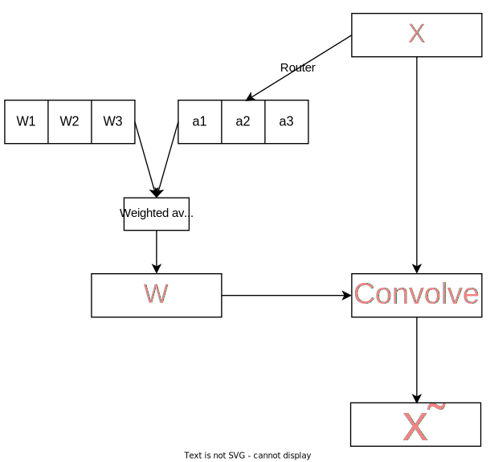

Figure 9.1. Overview of CondConv. Ibid.

 

There is one caveat that must be borne in mind when implementing CondConv: Given that CondConv is conditioned on the input, each data point is to be processed by a different set of convolutional parameters. PyTorch's convolutions, however, use the same weights & biases for every data point and thus cannot be used out of the box. Thanks to grouped convoloutions though, that can be surmounted by amalgamating the batch and channel axes into a single larger one and setting the group size to the batch size, i.e., each data point is represented by a different group. <a href="#snippet_9.1">Snippet 9.1</a> implements CondConv.  


import torch                                                          
from torch import nn
from torch.nn import functional as F

class Router(nn.Module):
	"""
	Routing function for CondConv.

	Args:
		in_dim (int): Number of input channels.
		n_experts (int): Number of experts.
		Default is 8.
	"""
	def __init__(
		self,
		in_dim: int,
		n_experts: int = 8,
		) -> None:
		super().__init__()

		self.linear = nn.Conv2d(
			in_channels=in_dim,
			out_channels=n_experts,
			kernel_size=1,
			)
	
	def forward(self, input: torch.Tensor) -> torch.Tensor:
		avg_pooled = F.adaptive_avg_pool2d(input, 1)
		attention = self.linear(avg_pooled)
		attention = F.sigmoid(attention)
		attention = attention.flatten(1, 3)
		return attention

class Combine(nn.Module):
	"""
	Combines multiple convolutional layers given attention values.

	Args:
		in_dim (int): Number of input channels.
		out_dim (int): Number of output channels.
		kernel_size (int): Kernel size of each convolution.
		Default is 3
		stride (int): Stride of each convolution.
		Default is 1
		padding (int): Padding of each convolution.
		Default is 1
		dilation (int): Dilation of each convolution.
		Default value is 1.
		groups (int): Number of groups of each convolution.
		Default is 1
		bias (bool): Whether each convolution should have a bias term.
		Default is True
		n_experts (int): Number of experts.
		Default is 8
	"""
	def __init__(
		self,
		in_dim: int,
		out_dim: int,
		kernel_size: int = 3,
		stride: int = 1,
		padding: int = 1,
		dilation: int = 1,
		groups: int = 1,
		bias: bool = True,
		n_experts: int = 8,
		) -> None:
		super().__init__()

		self.out_dim = out_dim
		self.stride = stride
		self.padding = padding
		self.dilation = dilation
		self.groups = groups

		weights = torch.randn(
			n_experts,
			out_dim,
			in_dim//groups,
			kernel_size,
			kernel_size,
			)
		self.weights = nn.Parameter(weights)
		self.bias = nn.Parameter(torch.randn(n_experts, out_dim)) if bias else None
		
	def forward(self, input: torch.Tensor, attention: torch.Tensor) -> torch.Tensor:
		batch_size, in_dim, height, width = input.shape
		input = input.reshape(1, batch_size*in_dim, height, width)

		weights = torch.einsum(
			'bn,noihw->boihw',
			attention,
			self.weights,
			)
		weights = weights.reshape(batch_size*self.out_dim, *weights.shape[2:])

		bias = None
		if self.bias is not None:
			bias = torch.einsum('bn,no->bo', attention, self.bias)
			bias = bias.reshape(batch_size*self.out_dim)

		output = F.conv2d(
			input=input,
			weight=weights,
			bias=bias,
			stride=self.stride,
			padding=self.padding,
			dilation=self.dilation,
			groups=batch_size*self.groups,
			)
		output = output.reshape(batch_size, self.out_dim, *output.shape[2:])
		return output

class CondConv(nn.Module):
	"""
	Conditionally parameterized convolution.

	Args:
		in_dim (int): Number of input channels.
		out_dim (int): Number of output channels.
		kernel_size (int): Kernel size of each convolution.
		Default is 3.
		stride (int): Stride of each convolution.
		Default is 1.
		padding (int): Padding of each convolution.
		Default is 1.
		dilation (int): Dilation of each convolution.
		Default value is 1.
		groups (int): Number of groups of each convolution.
		Default is 1.
		bias (bool): Whether each convolution should have a bias term.
		Default is True.
		n_experts (int): Number of experts.
		Default is 8.
	"""
	def __init__(
		self,
		in_dim: int,
		out_dim: int,
		kernel_size: int = 3,
		stride: int = 1,
		padding: int = 1,
		dilation: int = 1,
		groups: int = 1,
		bias: bool = True,
		n_experts: int = 8,
		) -> None:
		super().__init__()

		self.router = Router(
			in_dim=in_dim,
			n_experts=n_experts,
			)
		self.combine = Combine(
			in_dim=in_dim,
			out_dim=out_dim,
			kernel_size=kernel_size,
			stride=stride,
			padding=padding,
			dilation=dilation,
			groups=groups,
			bias=bias,
			n_experts=n_experts,
			)

	def forward(self, input: torch.Tensor) -> torch.Tensor:
		attention = self.router(input)
		output = self.combine(input, attention)
		return output


Snippet 9.1. Einstein summation is used to calculate the parameters' weighted average for readability. Alternatively, matrix multiplication could have been used.
 
By replacing standard convolutions in several CNNs with CondConv, accuracy on ImageNet is boosted with negligible increases in complexity (<a href="#table_9.1">table 9.1</a>).  

| **Architecture** | **Plain** | **With CondConv** |
|------------------|-----------|-------------------|
| MobileNetV1      | 71.9%     | 73.7%             |
| MobileNetV2      | 71.6%     | 74.6%             |
| MnasNet-A1       | 74.9%     | 76.2%             |
| ResNet-50        | 77.7%     | 78.6%             |
| EfficientNet-B0  | 77.2%     | 78.3%             |

Table 9.1. Top-1 accuracies of multiple networks, with or without CondConv, on ImageNet.

---

# 10. Dynamic Convolution

Dynamic convolution[[6]](#[6]), which forms the backbone of DY-CNNs, is almost identical to ConvConv, and there are only a few small distinctions that differentiate them. In particular, the authors reflect that by enforcing the outputs of the router to sum to one, the model would train more smoothly. Softmax is the natural choice in this scenario, and it therefore substitutes sigmoid for normalizing the attention values. 

However, softmax's one-hot output impedes training compared to sigmoid in the initial epochs. During the early iterations, sigmoid ensures all attention values are close, a feature that facilitates learning because it allows the parameters of each expert to be optimized concurrently. Softmax's output, in contrast, follows a nearly one-hot distribution, so while a convolutional layer or two, since they have been assigned higher attention values, are being updated, the other convolutional layers, owing to their virtually nil attention values, are neglected. 

An antidote would be to introduce a temperature coefficient for softmax, as expressed in <a href="#equation_10.1">equation 10.1</a>, where a larger temperature translates into a more uniform output. At first, this temperature should be high to ensure the parameters of all experts are being updated, but it can be gradually decreased since the experts' parameters will have been somewhat optimized after sufficient training steps. <a href="#figure_10.1">Figure 10.1</a> demonstrates the effects of this temperature coefficient on the output distribution.

$$
\textrm{Softmax}(\bold x; \tau) = \frac {e^{\frac{\bold x} {\tau}}} {\sum_{i=1}^{n}e^{\frac{\bold x_i} {\tau}}}
$$

Equation 10.1. \(\bold x \isin \reals^n\) is the input, and \(\tau\) is the temperature coefficient. \(\tau = 1\) yields standard softmax.

 

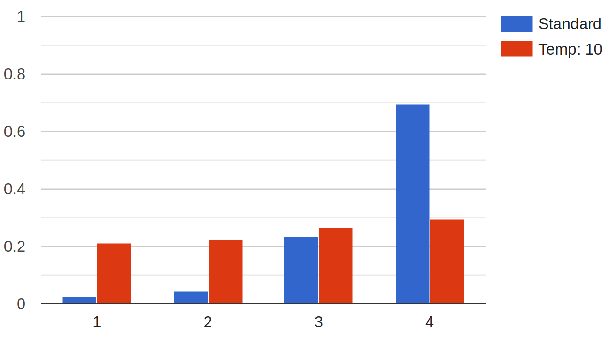

Figure 10.1. Softmax, with or without temperature, for dummy input \(\bold x^{\textrm{T}} = [-2.1, -1.5, 0.1, 1.2]\). The x-axis is the index of each element of \(\bold x\), and the y-axis is the output of softmax. Without a temperature coefficient, the \(4^{\textrm{th}}\) element dominates the rest, but with temperature, they're nearly equal. Ibid.

 
<a href="#snippet_10.1">Snippet 10.1</a> implements dynamic convolution. The router aside, it is identical to CondConv.  


import torch                                                          
from torch import nn
from torch.nn import functional as F

class Router(nn.Module):
	"""
	Routing function for dynamic convolution.

	Args:
		in_dim (int): Number of input channels.
		n_experts (int): Number of experts.
		Default is 8
		reduction_factor (int): Reduction factor
		for the bottleneck layer.
		Default is 4
		temperature (float): Temperature for softmax.
		Default is 30.0
	"""
	def __init__(
		self,
		in_dim: int,
		n_experts: int = 4,
		reduction_factor: int = 4,
		temperature: float = 30.0,
		) -> None:
		super().__init__()

		self.temperature = temperature 

		bottleneck_dim = in_dim//reduction_factor
		self.mlp = nn.Sequential(
			nn.Conv2d(
				in_channels=in_dim,
				out_channels=bottleneck_dim,
				kernel_size=1,
				),
			nn.ReLU(),
			nn.Conv2d(
				in_channels=bottleneck_dim,
				out_channels=n_experts,
				kernel_size=1,
				)
			)
	
	def forward(self, input: torch.Tensor) -> torch.Tensor:
		avg_pooled = F.adaptive_avg_pool2d(input, 1)
		attention = self.mlp(avg_pooled)/self.temperature
		attention = F.softmax(attention)
		attention = attention.flatten(1, 3)
		return attention

class Combine(nn.Module):
	"""
	Combines multiple convolutional layers given attention values.

	Args:
		in_dim (int): Number of input channels.
		out_dim (int): Number of output channels.
		kernel_size (int): Kernel size of each convolution.
		Default is 3
		stride (int): Stride of each convolution.
		Default is 1
		padding (int): Padding of each convolution.
		Default is 1
		dilation (int): Dilation of each convolution.
		Default value is 1.
		groups (int): Number of groups of each convolution.
		Default is 1
		bias (bool): Whether each convolution should have a bias term.
		Default is True
		n_experts (int): Number of experts.
		Default is 8
	"""
	def __init__(
		self,
		in_dim: int,
		out_dim: int,
		kernel_size: int = 3,
		stride: int = 1,
		padding: int = 1,
		dilation: int = 1,
		groups: int = 1,
		bias: bool = True,
		n_experts: int = 8,
		) -> None:
		super().__init__()

		self.out_dim = out_dim
		self.stride = stride
		self.padding = padding
		self.dilation = dilation
		self.groups = groups

		weights = torch.randn(
			n_experts,
			out_dim,
			in_dim//groups,
			kernel_size,
			kernel_size,
			)
		self.weights = nn.Parameter(weights)
		self.bias = nn.Parameter(torch.randn(n_experts, out_dim)) if bias else None
		
	def forward(self, input: torch.Tensor, attention: torch.Tensor) -> torch.Tensor:
		batch_size, in_dim, height, width = input.shape
		input = input.reshape(1, batch_size*in_dim, height, width)

		weights = torch.einsum(
			'bn,noihw->boihw',
			attention,
			self.weights,
			)
		weights = weights.reshape(batch_size*self.out_dim, *weights.shape[2:])

		bias = None
		if self.bias is not None:
			bias = torch.einsum('bn,no->bo', attention, self.bias)
			bias = bias.reshape(batch_size*self.out_dim)
		
		output = F.conv2d(
			input=input,
			weight=weights,
			bias=bias,
			stride=self.stride,
			padding=self.padding,
			dilation=self.dilation,
			groups=batch_size*self.groups,
			)
		output = output.reshape(batch_size, self.out_dim, *output.shape[2:])
		return output

class DynamicConv(nn.Module):
	"""
	Dynamic convolution.

	Args:
		in_dim (int): Number of input channels.
		out_dim (int): Number of output channels.
		kernel_size (int): Kernel size of each convolution.
		Default is 3.
		stride (int): Stride of each convolution.
		Default is 1.
		padding (int): Padding of each convolution.
		Default is 1.
		dilation (int): Dilation of each convolution.
		Default value is 1.
		groups (int): Number of groups of each convolution.
		Default is 1.
		bias (bool): Whether each convolution should have a bias term.
		Default is True.
		n_experts (int): Number of experts.
		Default is 8.
		reduction_factor (int): Reduction factor in the MLP of the router.
		Default is 4
		temperature (float): Temperature for softmax in the router.
		Default is 30.0
	"""
	def __init__(
		self,
		in_dim: int,
		out_dim: int,
		kernel_size: int = 3,
		stride: int = 1,
		padding: int = 1,
		dilation: int = 1,
		groups: int = 1,
		bias: bool = True,
		n_experts: int = 8,
		reduction_factor: int = 4,
		temperature: float = 30.0,
		) -> None:
		super().__init__()

		self.router = Router(
			in_dim=in_dim,
			n_experts=n_experts,
			reduction_factor=reduction_factor,
			temperature=temperature,
			)
		self.combine = Combine(
			in_dim=in_dim,
			out_dim=out_dim,
			kernel_size=kernel_size,
			stride=stride,
			padding=padding,
			dilation=dilation,
			groups=groups,
			bias=bias,
			n_experts=n_experts,
			)

	def forward(self, input: torch.Tensor) -> torch.Tensor:
		attention = self.router(input)
		output = self.combine(input, attention)
		return output


Snippet 10.1. Another minor difference between CondConv and dynamic convolution is that the latter employs a bottleneck MLP for extracting attention scores, whereas the former merely uses a linear layer.
 

<a href="#table_10.1">Table 10.1</a> exhibits the benefits of dynamic convolution. Importantly, DY-MobileNetV2 with \\(4\\) experts outperforms a CondConv-MobileNetV2 with twice as many experts (<a href="#table_10.2">table 10.2</a>).  

| **Architecture**  | **Plain** | **With dynamic convolution** |
|-------------------|-----------|------------------------------|
| MobileNetV2       | 72.0%     | 75.2%                        |
| MobileNetV3-Small | 67.4%     | 70.3%                        |
| ResNet-10         | 63.5%     | 67.7%                        |
| ResNet-18         | 70.4%     | 72.7%                        |

Table 10.1. Top-1 accuracies of MobileNets and ResNets, plain or with dynamic convolution, on ImageNet.

 

| **Architecture**  | **CondConv** | **Dynamic convolution** |
|-------------------|--------------|-------------------------|
| MobileNetV2 X 1.0 | 74.6%        | 75.2%                   |
| MobileNetV2 X 0.5 | 68.4%        | 69.9%                   |

Table 10.2. Top-1 accuracy of MobileNetV2, with CondConv (\(8\) experts) or dynamic convolution (\(4\) experts), on ImageNet.

---

# 11. Multi-Headed Self-Attention

Before discussing multi-headed self-attention (MHSA)[[36]](#[36]), it would be instructive to first examine information retrieval (IR) systems, which, on a high level, behave as follows[[27]](#[27]).

The first step is to define three fundamental concepts, namely, the _query_, _key_, and _value_. The query poses the needs of the user, every piece of information in the database is succinctly described by its key, and a value is the actual content the user is attempting to access. For instance, in the context of Google's search engine, the query would be the phrase the user is searching, the keys might be the headlines of every page Google has crawled, and the values would be the links to each page (<a href="#figure_11.1">figure 11.1</a>).  

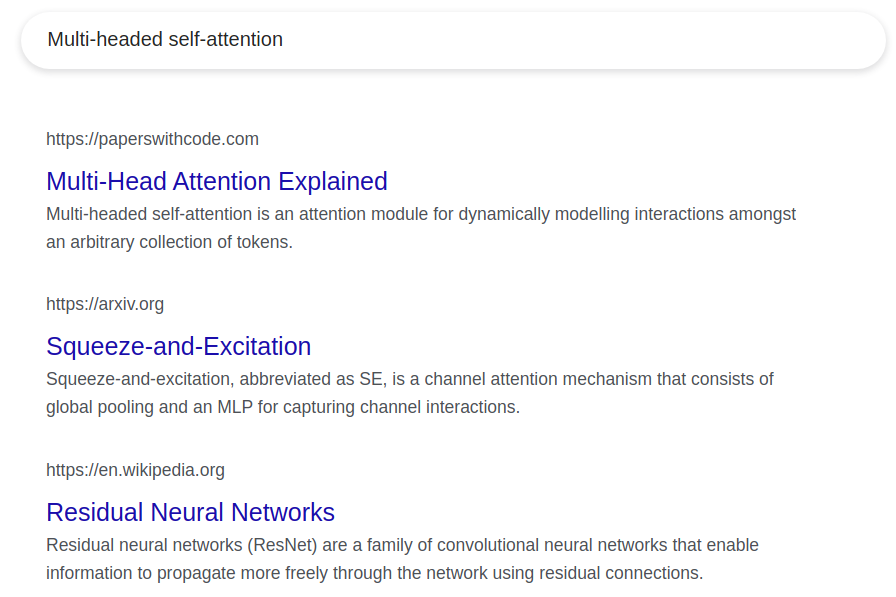

Figure 11.1. Example of the query-key-value framework. In reality, Google Search is substiantially more sophisticated, e.g., the keys contain publication dates, author names, etc. Ibid.

 

Second, the query is matched against every key to evaluate how well it corresponds to them. In this example, the search engine might extract vector representations for the query and the keys, and the cosine similarity between them is used to assess whether a query and key are similar or not (<a href="#figure_11.2">figure 11.2</a>).  

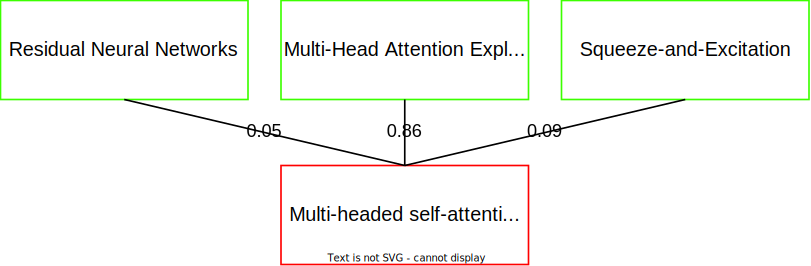

Figure 11.2. The similarity scores between the query and each key, with higher values indicating better matches. As expected, the query is most similar to "Multi-Head Attention Explained," but it should be added that "Squeeze-and-Excitation" has a higher score than "Residual Neural Networks," since the former is also an attention mechanism. Ibid.

 

Lastly, the values are sorted according to the similarity scores between their associated keys and the query. For example, the link to Papers With Code's website should appear at the top of the search results because its key was most similar to the query.

In short, the raison d'être of the query-key-value (QKV) strategy is to model the relationship between a query and several items in a database (e.g., the relation between a search phrase and several web pages). That is precisely the goal of attention mechanisms in deep learning, and scaled dot-product self-attention, referred to simply as self-attention (SA), which forms the basis of MHSA, adopts the QKV approach for capturing interactions within the data. 

For example, \\(\bold x_1 \isin \reals^{d}\\), \\(\bold x_2 \isin \reals^{d}\\), and \\(\bold x_3 \isin \reals^{d}\\) might be three items - also called tokens - in the data with dimensionality \\(d\\) (a.k.a. the token or embedding dimension), and the goal is to evaluate the relation between \\((\bold x_1, \bold x_2)\\) and \\((\bold x_1, \bold x_3)\\). It is important to note that SA has practically no inductive biases baked into it, and \\(\bold x_1\\), \\(\bold x_2\\), and \\(\bold x_3\\) can be any type of data. For instance, they can be flattened channels, in which case \\(d = hw\\), and MHSA would be modelling channel interactions. They can be three pixels, so \\(d\\) would be the number of channels, and SA would be capturing spatial relations. Etc. Furthermore, it is modality-agnostic and can be used with tabular data, text, images, and so forth, however, this article is only concerned with its applications in vision.

The first step is to obtain queries, keys, and values. \\(\bold x_1\\), \\(\bold x_2\\), and \\(\bold x_3\\) 
could simply be treated as the QKV vectors, but the model's expressivity would consequently be severely constrained. 
Instead, \\(\bold x_1\\) is linearly transformed to obtain the query, \\(\bold q \isin \reals^{64}\\), and
\\(\bold x_2\\) and \\(\bold x_3\\) are linearly transformed to obtain the keys, \\(\bold k_1 \isin \reals^{64}\\) and \\(\bold k_2 \isin \reals^{64}\\), 
and the values, \\(\bold v_1 \isin \reals^{64}\\) and \\(\bold v_2 \isin \reals^{64}\\). 
\\(64\\) is the dimensionality of each query, key, and value vector and is not set in stone, albeit
it is usually not modified.
This corresponds to the first part of the
Google Search example, where the user defines a query, and Google scrapes headlines (keys) and links (values) off the web.

Next, the similarity between \\(\bold q\\) and the keys must be evaluated.
 A natural choice would be the dot product, a magnitude-sensitive alternative
  to cosine similarity that measures the angle between two vectors but also takes their magnitudes into account.
   This gives \\(a'_1\\) and \\(a'_2\\), two scalars corresponding to the dot product between the query and the two keys, and they are normalized 
  through softmax to acquire \\(a_1\\) and \\(a_2\\). These two values are the attention scores, i.e., they express how much \\(\bold x_1\\) must attend to \\(\bold x_2\\) and \\(\bold x_3\\). This corresponds to the second part of
   the Google Search example, where the search phrase (query) was compared to
    the headlines (keys).

Then, \\(\bold v_1\\) and \\(\bold v_2\\) are averaged with weights \\(a_1\\) and \\(a_2\\) to get \\(\bold s \isin \reals^{64}\\). To authentically emulate Google Search, only the value with the largest similarity score
should be returned, i.e., \\(\bold v_1\\) if \\( a_1 >  a_2\\) and \\(\bold v_2\\) otherwise. That is known as _hard_ attention[[20]](#[20])[[41]](#[41])[[22]](#[22]), but 
SA is a type of _soft_ attention that takes all values into account, although they are scaled according to their similarity scores. Lastly, the dimensionality of \\(\bold s\\) is reverted to \\(d\\) through a linear 
layer since the input and output should have the same shape. The output of this linear transformation is the final output for \\(\bold x_1\\).
This process is repeated with \\(\bold x_2\\) and \\(\bold x_3\\) as the queries, and the three resultants - \\(\tilde \bold x_1 \isin \reals^d\\),
\\(\tilde \bold x_2 \isin \reals^d\\), and \\(\tilde \bold x_3 \isin \reals^d\\) - replace the original inputs.

<a href="#figure_11.3">Figure 11.3</a> summarizes this example.  

Figure 11.3. Summary of SA for three input vectors, with \(\bold x_1\) as the query. 
Softmax is omitted for simplicity, and the linear transformation of \(\bold s\) is not shown.
\(d = 4\), and the dimensionality of the query, key, and value vectors are \(2\) and not \(64\). Ibid.

 

It is time to be more formal and specific. Let \\(\bold X \isin \reals^{n \times d}\\) be the input, where \\(n\\) is the number of tokens
in the data, e.g., \\(3\\) in the toy example above, and \\(d\\) is the token dimension.
Three weight matrices, \\(\bold W_q \isin \reals^{d \times 64}\\), \\(\bold W_k \isin \reals^{d \times 64}\\), and 
\\(\bold W_k \isin \reals^{d \times 64}\\), transform \\(\bold X\\) to obtain \\(\bold Q \isin \reals^{n \times 64}\\),
 \\(\bold K \isin \reals^{n \times 64}\\), and \\(\bold V \isin \reals^{n \times 64}\\)
 (<a href="#equation_11.1">equation 11.1</a>). Matrix-multiplying the weight matrices with the entire input is equivalent to individually extracting queries, keys, or values from each token, but the latter would be much slower.

$$
\bold Q = \bold X \bold W_q \\\
\bold K = \bold X \bold W_k \\\
\bold V = \bold X \bold W_v \\\
$$

Equation 11.1.

 

Next, an attention matrix \\(\bold A' \isin \reals^{n \times n}\\) is obtained, where \\(\bold A'_{i,j}\\) is the dot product between the \\(i^{\textrm{th}}\\) query and \\(j^{\textrm{th}}\\) key. Again, going through every query and key one by one and calculating their dot product would be identical to matrix-multiplying \\(\bold Q\\) and \\(\bold K\\), albeit the keys must be transposed first (<a href="#equation_11.2">equation 11.2</a>). It should be noted that each token is also compared against itself, that is, the \\(i^{\textrm{th}}\\) query is also compared to the \\(i^{\textrm{th}}\\) key. Afterwards, \\(\bold A'\\) is normalized using softmax, along the column axis, to get \\(\bold A \isin \reals^{n \times n}\\), as written in <a href="#equation_11.3">equation 11.3</a>.  

$$
\bold A' = \bold Q \bold K^{\textrm{T}}
$$

Equation 11.2.

 

$$
\bold A_{:, i} = \frac {e^{\bold A'_{:, i}}} {\sum_{j=1}^{n}e^{\bold A'_{j, i}}}
$$

Equation 11.3. \(\forall i \isin \{1, 2, ..., n\}\).

 

Then, the weighted average of all the value vectors is taken using \\(\bold A\\) to get \\(\bold S \isin \reals^{n \times 64}\\). Once again, matrix-multiplying \\(\bold A\\) and \\(\bold V\\) would yield the desired result (<a href="#equation_11.4">equation 11.4</a>).

$$
\bold S = \bold A \bold V
$$

Equation 11.4.

 

Finally, \\(\bold S\\) is transformed by a linear layer with weight matrix \\(\bold W \isin \reals^{64 \times d}\\) to get the final output \\(\tilde \bold X \isin \reals^{n \times d}\\) (<a href="#equation_11.5">equation 11.5</a>).

$$
\tilde \bold X = \bold S \bold W
$$

Equation 11.5.

 
<a href="#figure_11.4">Figure 11.4</a> outlines this series of calculations. Although this may appear knotty, it is no different from the example with \(\bold x_1\), \(\bold x_2\), and \(\bold x_3\), other than the vectorization of the operations.  

Figure 11.4. Self-attention for input \(\bold X \isin \reals^{3 \times 4}\). 
Softmax is omitted for simplicity. Ibid.

 
The PyTorch implementation of SA is simple as it consists only of the series of matrix multiplications outlined above, but it contains an extra step not yet introduced. Particularly, the attention matrix is divided by the square root of the dimension of the QKV vectors, \(8 = \sqrt{64}\). The name <i>scaled</i> dot-product attention originates from this tweak, which is believed to stabilize training. SA's implementation can be found in <a href="#snippet_11.1">snippet 11.1</a>.  


from math import sqrt                                                          
from typing import Tuple

import torch
from torch import nn
from torch.nn import functional as F

class QKV(nn.Module):
	"""
	Extracts queries, keys, and values for SA.

	Args:
		in_dim (int): Dimension of input.
		qkv_dim (int): Dimension of each QKV vector.
		Default is 64.
	"""
	def __init__(
		self,
		in_dim: int,
		qkv_dim: int = 64,
		) -> None:
		super().__init__()

		self.qkv_dim = qkv_dim
		self.to_qkv = nn.Linear(
			in_features=in_dim,
			out_features=3*qkv_dim,
			)
		
	def forward(self, input: torch.Tensor) -> Tuple[torch.Tensor, ...]:
		batch_size, n_tokens, in_dim = input.shape
		qkv = self.to_qkv(input)
		qkv = qkv.reshape(batch_size, n_tokens, 3, self.qkv_dim)
		qkv = qkv.permute(2, 0, 1, 3)
		return qkv.unbind(dim=0)

def get_attention(queries: torch.Tensor, keys: torch.Tensor) -> torch.Tensor:
	"""
	Calculates scaled dot-product attention given queries and keys.

	Args:
		queries (torch.Tensor): Queries.
		keys (torch.Tensor): Keys.
	
	Returns (torch.Tensor): Attention calculated using the provided queries
	and keys.
	"""
	attention = (queries @ keys.transpose(-2, -1)) / sqrt(queries.shape[-1])
	attention = F.softmax(attention, dim=-1)
	return attention

class SA(nn.Module):
	"""
	Scaled dot-product self-attention.

	Args:
		in_dim (int): Dimension of input
		qkv_dim (int): Dimension of each QKV vector.
		Default is 64.
	"""
	def __init__(
		self,
		in_dim: int,
		qkv_dim: int = 64,
		) -> None:
		super().__init__()

		self.qkv_dim = qkv_dim
		self.to_qkv = QKV(
			in_dim=in_dim,
			qkv_dim=qkv_dim,
			)
		self.to_output = nn.Linear(
			in_features=qkv_dim,
			out_features=in_dim,
			)
	
	def forward(self, input: torch.Tensor) -> torch.Tensor:
		batch_size, n_tokens, in_dim = input.shape

		queries, keys, values = self.to_qkv(input)
		attention = get_attention(
			queries=queries,
			keys=keys,
			)
		output = attention @ values

		output = self.to_output(output)
		return output


Snippet 11.1. Three separate linear layers for extracting the queries, keys, and values 
can be condensed into a single one with thrice as many output features.
 

To further bolster the model's capabilities, multiple self-attention modules, with each being dubbed a <i>head</i>, can be executed in parallel and their outputs summed to get multi-headed self-attention. Implementation-wise, one can create several instances of SA, individually run the input through them, and add their results, but that would be too slow, and a vectorized implementation would be more efficient. A new axis can be constructed that represents the heads, and thanks to PyTorch's handling of matrix multiplications, not much else needs to be modified (<a href="#snippet_11.2">snippet 11.2</a>).  


from typing import Tuple                                                          
from math import sqrt

import torch
from torch import nn
from torch.nn import functional as F

class QKV(nn.Module):
	"""
	Extracts queries, keys, and values for MHSA.

	Args:
		in_dim (int): Dimension of input.
		n_heads (int): Number of heads.
		Default is 8.
	"""
	def __init__(
		self,
		in_dim: int,
		n_heads: int = 8,
		) -> None:
		super().__init__()

		self.n_heads = n_heads
		self.qkv_dim = in_dim//n_heads
		self.to_qkv = nn.Linear(
			in_features=in_dim,
			out_features=3*in_dim,
			)
		
	def forward(self, input: torch.Tensor) -> Tuple[torch.Tensor, ...]:
		batch_size, n_tokens, in_dim = input.shape
		qkv = self.to_qkv(input)
		qkv = qkv.reshape(batch_size, n_tokens, 3, self.n_heads, self.qkv_dim)
		qkv = qkv.permute(2, 0, 3, 1, 4)
		return qkv.unbind(dim=0)

def get_attention(queries: torch.Tensor, keys: torch.Tensor) -> torch.Tensor:
	"""
	Calculates scaled dot-product attention given queries and keys.

	Args:
		queries (torch.Tensor): Queries.
		keys (torch.Tensor): Keys.
	
	Returns (torch.Tensor): Attention calculated using the provided queries
	and keys.
	"""
	attention = (queries @ keys.transpose(-2, -1)) / sqrt(queries.shape[-1])
	attention = F.softmax(attention, dim=-1)
	return attention

class MHSA(nn.Module):
	"""
	Multi-headed self-attention.

	Args:
		in_dim (int): Dimension of input
		n_heads (int): Number of heads.
		Default is 8
	"""
	def __init__(
		self,
		in_dim: int,
		n_heads: int = 8,
		) -> None:
		super().__init__()

		self.n_heads = n_heads
		self.to_qkv = QKV(
			in_dim=in_dim,
			n_heads=n_heads,
			)
		self.to_output = nn.Linear(
			in_features=in_dim,
			out_features=in_dim,
			)
	
	def forward(self, input: torch.Tensor) -> torch.Tensor:
		batch_size, n_tokens, in_dim = input.shape

		queries, keys, values = self.to_qkv(input)
		attention = get_attention(
			queries=queries,
			keys=keys,
			)
		output = attention @ values

		output = output.transpose(1, 2)
		output = output.reshape(batch_size, n_tokens, in_dim)
		output = self.to_output(output)

		return output


Snippet 11.2. Most MHSA implementations set the QKV dimensionality to <code>in_dim/n_heads</code> in lieu of accepting it as an argument. Rather than first passing the heads' outputs to separate linear layers and summing the results afterwards, the heads are concatenated first in lines 92-93 and then linearly transformed. The two methods are equivalent.
 

Being a versatile module, there are myriad approaches for integrating MHSA into vision models.
The most notable of neural nets utilizing MHSA is the vision transformer
(ViT)<a href="#[7]">[7]</a>, a convolution-free model closely based off of the transformer
architecture<a href="#[36]">[36]</a> that is solely composed of multiple transformer layers stacked on top of one another, unlike some other architectures such as
non-local networks (NLNet)[[38]](#[38]), bottleneck transformers (BoTNet)[[29]](#[29]), and stand-alone self-attention (SASA)[[26]](#[26]) that are hybrids of attention & convolutions and do not enjoy ViT's simple, isotropic layout. A transformer layer,
depicted in <a href="#figure_11.6">figure 11.6</a>, is composed of MHSA applied over the spatial axes plus
a multilayer perceptron, with layer normalization and residual connections in between.  

Figure 11.6. A single transformer layer used by ViT. Image from figure 1 of <a href="#[7]">[7]</a>. 

 
Some pre-processing is necessary before feeding image data to a transformer. Particularly, transformers expect one-dimensional inputs, and the large spatial dimension of pictures cannot be handled by MHSA due to its quadratic complexity. Therefore, ViT uses an aggressive downsampling procedure, akin to the stem of CNNs, to downsample the input, usually by very large factors like \(16\), whilst increasing the number of channels to the token dimension. 
For example, an input of shape \(3 \times 224 \times 224\) would be downsampled to
\(512 \times 14 \times 14\) using a convolution of kernel size \(16 \times 16\), 
a stride of \(16 \times 16\), and \(512\) output channels, and thereafter flattened to shape \(512 \times 196\). ViTs and more broadly transformers typically expect the embedding dimension to be last, so the two axes are transposed to shape \(196 \times 512\). Alternatively, one can consider an image to be composed of non-overlapping patches, where each patch has a size of, e.g., \(16 \times 16\) pixels. In that case, ViT is flattening these patches to \(256\)-dimensional vectors that are then transformed through a linear layer to the desired embedding dimension. These resulting vectors are also called patch embeddings.  

Moreover, it is important to note that self-attention is permutation-invariant, that is, permutations in the input merely permute the output and do not change its content. Transformers therefore have no notion of order; for instance, a transformer would be unable to differentiate between 
"Alice visited Bob" and "Bob visited Alice," which can be detrimental to performance. Learnable vectors, dubbed position embeddings, are added to the
patch embeddings to rectify this problem by injecting order into the data. One of the chief disadvantages of this method is that the model cannot accept variable resolutions since the number of patches must always be equal to the number of position embedding vectors, and changing the input's height or width results in a different number of patches.

<a href="#figure_11.7">Figure 11.7</a> depicts this entire process, and an implementation of the vision transformer can be found in [this repository](https://github.com/bobmcdear/vit-pytorch).  

Figure 11.7. An overview of ViT for a single-channelled input of shape \(4 \times 4\), patch size \(2 \times 2\),
and \(2\) as the embedding dimension. The same linear layer is used for all four patches. Image by the author. 

 

Sundry strategies exist for training vision transformers, such as masked image modelling<a href="#[1]">[1]</a><a href="#[40]">[40]</a><a href="#[11]">[11]</a>, joint language-image training<a href="#[24]">[24]</a><a href="#[43]">[43]</a>, or plain supervised learning<a href="#[2]">[2]</a><a href="#[35]">[35]</a>, with quite an appreciable influence on final performance compared to CNNs, and the reader is referred to [this benchmark](https://paperswithcode.com/sota/image-classification-on-imagenet?tag_filter=4%2C171) for further information.

---

# 12. Conclusion

In this article, seminal attention modules in computer vision were explored and implemented in PyTorch. Such layers include but are not limited to squeeze-and-excitation, a method for adaptively weighing the input's channels, the selective kernel unit, a type of branch attention that adjusts its kernel size according to the input, and multi-headed self-attention, a flexible layer for modelling pairwise relationships amongst a collection of arbitrary items. 

It should be stressed that this has been but a mere glimpse at the vast world of vision attention. However, the modules presented here are chief representatives of most kinds of image attention, and layers not discussed are in some way or other related to them and would hence not be utterly alien to readers of this article. Those interested in diving deeper into this topic can refer to <a href="#[9]">[9]</a>, <a href="#[10]">[10]</a>, and <a href="#[16]">[16]</a>.

---

# References

[1] Hangbo Bao, Li Dong, Songhao Piao, Furu Wei. [BEiT: BERT Pre-Training of Image Transformers](https://arxiv.org/abs/2106.08254). _arXiv:2106.08254_, 2021.

[2] Lucas Beyer, Xiaohua Zhai, Alexander Kolesnikov. [Better plain ViT baselines for ImageNet-1k](https://arxiv.org/abs/2205.01580). _arXiv:2205.01580_, 2022.

[3] Gianni Brauwers, Flavius Frasincar. [A General Survey on Attention Mechanisms in Deep Learning](https://arxiv.org/abs/2203.14263).
In _TKDE_, 2021.

[4] Andrew Brock, Soham De, Samuel Smith. [Characterizing signal propagation to close the performance gap in unnormalized ResNets](https://arxiv.org/abs/2101.08692). In _ICLR_, 2021.

[5] Andrew Brock, Soham De, Samuel Smith, Karen Simonyan. [High-Performance Large-Scale Image Recognition Without Normalization](https://arxiv.org/abs/2102.06171). In _ICML_, 2021.

[6] Yinpeng Chen, Xiyang Dai, Mengchen Liu, Dongdong Chen, Lu Yuan, Zicheng Liu. [Dynamic Convolution: Attention over Convolution Kernels](https://arxiv.org/abs/1912.03458). In _CVPR_, 2020.

[7] Alexey Dosovitskiy, Lucas Beyer, Alexander Kolesnikov, Dirk Weissenborn, Xiaohua Zhai, Thomas Unterthiner, Mostafa Dehghani, Matthias Minderer, Georg Heigold, Sylvain Gelly, Jakob Uszkoreit, Neil Houlsby. [An Image is Worth 16x16 Words: Transformers for Image Recognition at Scale](https://arxiv.org/abs/2010.11929). In _ICLR_, 2021.

[8] Kunihiko Fukushima. [Neocognitron: A Self-organizing Neural Network Model for a Mechanism of Pattern Recognition Unaffected by Shift in Position](https://www.rctn.org/bruno/public/papers/Fukushima1980.pdf). In _Biological Cybernetics_, 1980.

[9] Meng-Hao Guo, Tian-Xing Xu, Jiang-Jiang Liu, Zheng-Ning Liu, Peng-Tao Jiang, Tai-Jiang Mu, Song-Hai Zhang, Ralph Martin, Ming-Ming Cheng, Shi-Min Hu.
[Attention Mechanisms in Computer Vision: A Survey](https://arxiv.org/abs/2111.07624). In _Computational Visual Media_, 2022.

[10] Kai Han, Yunhe Wang, Hanting Chen, Xinghao Chen, Jianyuan Guo, Zhenhua Liu, Yehui Tang, An Xiao, Chunjing Xu, Yixing Xu, Zhaohui Yang, Yiman Zhang, Dacheng Tao. [A Survey on Vision Transformer](https://arxiv.org/abs/2012.12556). In _TPAMI_, 2022.

[11] Kaiming He, Xinlei Chen, Saining Xie, Yanghao Li, Piotr Dollár, Ross Girshick. [Masked Autoencoders Are Scalable Vision Learners](https://arxiv.org/abs/2111.06377). In _CVPR_, 2022.

[12] Jie Hu, Li Shen, Samuel Albanie, Gang Sun, Andrea Vedaldi. [Gather-Excite: Exploiting Feature Context in Convolutional Neural Networks](https://arxiv.org/abs/1810.12348). In _NeurIPS_, 2018.

[13] David Hubel, Torsten Wiesel. [Receptive fields, binocular interaction and functional architecture in the cat's visual cortex](https://www.ncbi.nlm.nih.gov/pmc/articles/PMC1359523/). In _The Journal of Physiology_, 1962.

[14] Jie Hu, Li Shen, Samuel Albanie, Gang Sun, Enhua Wu. [Squeeze-and-Excitation Networks](https://arxiv.org/abs/1709.01507).
In _CVPR_, 2018.

[15] Nancy Kanwisher. [The Human Brain course at MIT, Lecture 24](https://www.youtube.com/watch?v=B4a0WdGp52g). 2019.

[16] Salman Khan, Muzammal Naseer, Munawar Hayat, Syed Waqas Zamir, Fahad Shahbaz Khan, Mubarak Shah. [Transformers in Vision: A Survey](https://arxiv.org/abs/2101.01169). In _CSUR_, 2022.

[17] Youngwan Lee, Jongyoul Park. [CenterMask: Real-Time Anchor-Free Instance Segmentation](https://arxiv.org/abs/1911.06667).
In _CVPR_, 2020.

[18] Xiang Li, Wenhai Wang, Xiaolin Hu, Jian Yang. [Selective Kernel Networks](https://arxiv.org/abs/1903.06586). In _CVPR_, 2019.

[19] Wenjie Luo, Yujia Li, Raquel Urtasun, Richard Zemel. [Understanding the Effective Receptive Field in Deep Convolutional Neural Networks](https://arxiv.org/abs/1701.04128). In _NeurIPS_, 2016.

[20] Volodymyr Mnih, Nicolas Heess, Alex Graves, Koray Kavukcuoglu. [Recurrent Models of Visual Attention](https://arxiv.org/abs/1406.6247). In _NeurIPS_, 2014.

[21] Andrew Ng. [The Deep Learning Specialization course, Course 5](https://www.youtube.com/watch?v=SysgYptB198). 2018.

[22] Athanasios Papadopoulos, Paweł Korus, Nasir Memon. [Hard-Attention for Scalable Image Classification](https://arxiv.org/abs/2102.10212). In _NeurIPS_, 2021.

[23] Jongchan Park, Sanghyun Woo, Joon-Young Lee, In Kweon. [BAM: Bottleneck Attention Module](https://arxiv.org/abs/1807.06514). In _BMCV_, 2018.

[24] Alec Radford, Jong Wook Kim, Chris Hallacy, Aditya Ramesh, Gabriel Goh, Sandhini Agarwal, Girish Sastry, Amanda Askell, Pamela Mishkin, Jack Clark, Gretchen Krueger, Ilya Sutskever. [Learning Transferable Visual Models From Natural Language Supervision](https://arxiv.org/abs/2103.00020). In _ICML_, 2021.

[25] Ilija Radosavovic, Raj Kosaraju, Ross Girshick, Kaiming He, Piotr Dollár. [Designing Network Design Spaces](https://arxiv.org/abs/2003.13678).
In _CVPR_, 2020.

[26] Prajit Ramachandran, Niki Parmar, Ashish Vaswani, Irwan Bello, Anselm Levskaya, Jonathon Shlens. [Stand-Alone Self-Attention in Vision Models](https://arxiv.org/abs/1906.05909). In _NeurIPS_, 2019. 

[27] Mark Sanderson, W. Bruce Croft. [The History of Information Retrieval Research](https://ieeexplore.ieee.org/document/6182576). In _Proc. IEEE_, 2012.

[28] Lothar Spillmann, Birgitta Dresp-Langley, Chia-Huei Tseng. [Beyond the classical receptive field: The effect of contextual stimuli](https://pubmed.ncbi.nlm.nih.gov/26200888/). In _Journal of Vision_, 2015.

[29] Aravind Srinivas, Tsung-Yi Lin, Niki Parmar, Jonathon Shlens, Pieter Abbeel, Ashish Vaswani. [Bottleneck Transformers for Visual Recognition](https://arxiv.org/abs/2101.11605). In _CVPR_, 2021.

[30] Christian Szegedy, Sergey Ioffe, Vincent Vanhoucke, Alex Alemi. [Inception-v4, Inception-ResNet and the Impact of Residual Connections on Learning](https://arxiv.org/abs/1602.07261). In _CVPR_, 2017.

[31] Christian Szegedy, Wei Liu, Yangqing Jia, Pierre Sermanet, Scott Reed, Dragomir Anguelov, Dumitru Erhan, Vincent Vanhoucke, Andrew Rabinovich. [Going Deeper with Convolutions](https://arxiv.org/abs/1409.4842). In _CVPR_, 2015.

[32] Christian Szegedy, Vincent Vanhoucke, Sergey Ioffe, Jonathon Shlens, Zbigniew Wojna. [Rethinking the Inception Architecture for Computer Vision](https://arxiv.org/abs/1512.00567). In _CVPR_, 2016.

[33] Mingxing Tan, Quoc Le. [EfficientNet: Rethinking Model Scaling for Convolutional Neural Networks](https://arxiv.org/abs/1905.11946).
In _ICML_, 2019.

[34] Mingxing Tan, Quoc Le. [EfficientNetV2: Smaller Models and Faster Training](https://arxiv.org/abs/2104.00298).
In _ICML_, 2021.

[35] Hugo Touvron, Matthieu Cord, Hervé Jégou. [DeiT III: Revenge of the ViT](https://arxiv.org/abs/2204.07118). _arXiv:2204.07118_, 2022.

[36] Ashish Vaswani, Noam Shazeer, Niki Parmar, Jakob Uszkoreit, Llion Jones, Aidan Gomez, Lukasz Kaiser, Illia Polosukhin. [Attention Is All You Need](https://arxiv.org/abs/1706.03762). In _NeurIPS_, 2017. 

[37] Qilong Wang, Banggu Wu, Pengfei Zhu, Peihua Li, Wangmeng Zuo, Qinghua Hu. [ECA-Net: Efficient Channel Attention for Deep Convolutional Neural Networks](https://arxiv.org/abs/1910.03151). In _CVPR_, 2020.

[38] Xiaolong Wang, Ross Girshick, Abhinav Gupta, Kaiming He. [Non-local Neural Networks](https://arxiv.org/abs/1711.07971). In _CVPR_, 2018.

[39] Sanghyun Woo, Jongchan Park, Joon-Young Lee, In Kweon. [CBAM: Convolutional Block Attention Module](https://arxiv.org/abs/1807.06521).
In _ECCV_, 2018.

[40] Zhenda Xie, Zheng Zhang, Yue Cao, Yutong Lin, Jianmin Bao, Zhuliang Yao, Qi Dai, Han Hu. [SimMIM: A Simple Framework for Masked Image Modeling](https://arxiv.org/abs/2111.09886). In _CVPR_, 2022.

[41] Kelvin Xu, Jimmy Ba, Ryan Kiros, Kyunghyun Cho, Aaron Courville, Ruslan Salakhutdinov, Richard Zemel, Yoshua Bengio. [Show, Attend and Tell: Neural Image Caption Generation with Visual Attention](https://arxiv.org/abs/1502.03044). In _ICML_, 2015.

[42] Brandon Yang, Gabriel Bender, Quoc Le, Jiquan Ngiam. [CondConv: Conditionally Parameterized Convolutions for Efficient Inference](https://arxiv.org/abs/1904.04971). In _NeurIPS_, 2019.

[43] Jiahui Yu, Zirui Wang, Vijay Vasudevan, Legg Yeung, Mojtaba Seyedhosseini, Yonghui Wu. [CoCa: Contrastive Captioners are Image-Text Foundation Models](https://arxiv.org/abs/2205.01917). _arXiv:2205.01917_, 2022.

[44] Hang Zhang, Chongruo Wu, Zhongyue Zhang, Yi Zhu, Haibin Lin, Zhi Zhang, Yue Sun, Tong He, Jonas Mueller, R. Manmatha, Mu Li, Alexander Smola. [ResNeSt: Split-Attention Networks](https://arxiv.org/abs/2004.08955). In _CVPR_, 2022.

---
